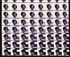

**[home](index.md) > [other work](otherwork.md) > art 1982**

JHT art 1982  
[1981](art1981.md) 1982 [1983](art1983.md) [1985](art1985.md) [1988](art1988.md) [1989](art1989.md)

architecture machine group  
at MIT

)

Self portrait while at Arc Mac. I wrote software to colorized a still image. The image would move through a series of random colors. I selected stills that were interesting.

Image from a news paper colorized using same algorithm.

)

)

Collage I created for Words Images GraphicS (WIGS) class at the Visible Language Workshop at MIT.

My photograph of a traffic accident near the Charles river.

) 

)

Digital transition between man and woman. Created by Kate Smith and Tyler Peppel. Images of the artist in residence in the Visible Language Workshop.

Portrait of me working on MIDI software on IBM PC. Photograph by Richard Beers.

)

)

Portrait of me in NYC by my friend Hui.  

 

[top](#topofpage)

**.........................................**

� 2001 John Henry Thompson - site by [Pixelyze](http://www.pixelyze.com/) & [CAGE](http://www.cage.nl/)

