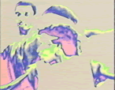
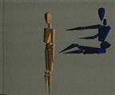

}  

  

**[home](index.html) > [other work](otherwork.html) > art 1983**

JHT art 1983  
[1981](art1981.html) [1982](art1982.html) 1983 [1985](art1985.html) [1988](art1988.html) [1989](art1989.html)

visible language workshop  
at MIT

Art work created while at MIT Visible Language Workshop 1983-84.

  

 

Stills for a 3-D computer generated animation "Launch", created at the Visible Language Workshop department at MIT during the period 1983-84. I wrote the modeling software, built the hardware controller to connect the main computer to the 1-inch Apex video tape recorder, and created the animation. I spent several months building the entire system. The computer would run over night for about 8 hours to render and record frame-by-frame a few seconds of animation.

 

Stills from a music video "Color Dance" created at the Visible Language Workshop at MIT during the period 1983-84. The dancers pictured are Countney Grey, an MIT student at the time, and his troupe. I programmed the computer frame buffer to create colorized video in real-time. I also directed and edited the video.

 

Frame from "Challenge" animation.

Frame from "Meeting" animation.

Frame from "Blow" animation. My last frame-by-frame  
computer rendered animation. A video captured frame is  
combined with computer rendered objects.  

[top](#topofpage)

**.........................................**

� 2001 John Henry Thompson - site by [Pixelyze](http://www.pixelyze.com/) & [CAGE](http://www.cage.nl/)

