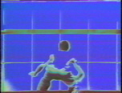

**[home](index.md) > [other work](otherwork.md) > art 1985**

JHT art 1985  
[1981](art1981.md) [1982](art1982.md) [1983](art1983.md) 1985 [1988](art1988.md) [1989](art1989.md)

music video

Stills from music videos created at the MIT Film / Video, MIT Media Lab and Lucas Film DroidWorks 1985.

"Apart" using custom software and Media Lab frame buffers.

"Fabric" music video. Original music by Arron Spenser. Dance by Shani Strothers.Fabric art by Shani Strothers.

"Pair" music video. Original music by Arron Spenser.

"Alena" video, using Fairlight Video Instrument.

Capoiera Dance using Fairlight Video Instrument. Dance by students of Capoira Mastre Marcello Pieria.

[top](#topofpage)

**.........................................**

� 2001 John Henry Thompson - site by [Pixelyze](http://www.pixelyze.com/) & [CAGE](http://www.cage.nl/)

