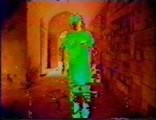
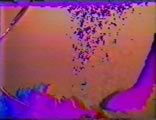

}  

  

**[home](index.html) > [other work](otherwork.html) > art 1989**

JHT art 1989  
[1981](art1981.html) [1982](art1982.html) [1983](art1983.html) [1985](art1985.html) [1988](art1988.html) 1989

experimental

Experiments in real-time video painting and digital compositing using Macintosh II computer, video digitizer, and custom software. At Benjamin Bergery's studio in LA, 1989.

  

 

)

Benjamin digitally extracted from life video, colorized, and composited with still graphics.

"Fish Art." Digitally extracted movement used as digital paint brush

)

)

"The Hand." Digitally extracted movement used as digital  
paint brush.

 

[top](#topofpage)

**.........................................**

� 2001 John Henry Thompson - site by [Pixelyze](http://www.pixelyze.com/) & [CAGE](http://www.cage.nl/)

