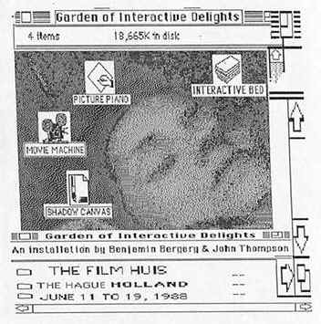
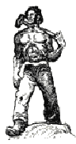

 JHT Background - Bio .subtitle { font-family: Courier New,Arial,Verdana,Helvetica; font-size: 16px; color: #748376; font-weight: bold } .pagetitle { font-family: Courier New,Arial,Verdana,Helvetica; font-size: 18px; color: black; font-weight: bold } .textwhite7 { font-family: Courier New,Arial,Verdana,Helvetica; font-size: 10px; color: white; } .textwhite8 { font-family: Courier New,Arial,Verdana,Helvetica; font-size: 10px; color: white; } .textwhite9 { font-family: Courier New,Arial,Verdana,Helvetica; font-size: 12px; color: white; } .bodytext { font-family: Courier New,Arial,Verdana,Helvetica; font-size: 12px; color: black; } .bodytext7 { font-family: Courier New,Arial,Verdana,Helvetica; font-size: 10px; color: black; } .bodytext8 { font-family: Courier New,Arial,Verdana,Helvetica; font-size: 10px; color: black; } .bodytext10 { font-family: Courier New,Arial,Verdana,Helvetica; font-size: 12px; color: black; } .bodytext11 { font-family: Courier New,Arial,Verdana,Helvetica; font-size: 12px; color: black; } .bodytext12 { font-family: Courier New,Arial,Verdana,Helvetica; font-size: 12px; color: black; } .bodytext14 { font-family: Courier New,Arial,Verdana,Helvetica; font-size: 14px; color: black; } .copyright { font-family: Courier New,Arial,Verdana,Helvetica; font-size: 10px; color: #748376; } .green8 { font-family: Courier New,Arial,Verdana,Helvetica; font-size: 10px; color: #748376; font-weight: bold } .green10 { font-family: Courier New,Arial,Verdana,Helvetica; font-size: 12px; color: #748376; font-weight: bold } .green12 { font-family: Courier New,Arial,Verdana,Helvetica; font-size: 12px; color: #748376; font-weight: bold } .green14 { font-family: Courier New,Arial,Verdana,Helvetica; font-size: 14px; color: #748376; font-weight: bold } .green16 { font-family: Courier New,Arial,Verdana,Helvetica; font-size: 16px; color: #748376; font-weight: bold } .green18 { font-family: Courier New,Arial,Verdana,Helvetica; font-size: 18px; color: #748376; font-weight: bold } a:link { color: #993333; text-decoration: underline; font-weight: bold; } a:active { color: #008080; text-decoration: none; font-weight: bold; } a:visited { color: #421F13; text-decoration: underline; font-weight: bold; } body { background-color: #9EA8A0; background-image: url("images/greenvidback1.jpg"); margin-top: 0; margin-left: 0; } td { font-family: Courier New,Helvetica,Arial,Verdana; font-size: 12px; color: black}  

   

**[home](index.html) > [background](background.html) > bio**

JHT background  
bio [resume](resume.html)

  
bio

**My most significant contribution to the computer industry to date is the invention of the** [Macromedia](http://www.macromedia.com) [Director Lingo scripting language](http://www.macromedia.com/software/director/)
====================================================================================================================================================================================================================================================

I've also helped nurture a generation of multimedia professionals as a graduate level college professor at [New York University](http://itp.nyu.edu/), and author of the "[Macromedia Director Lingo Workshop](lingoworkshop.html)" book. 

I studied studio art at the New York Student Art League and the Boston Museum School. I earned my degree in Computer Science and Visual Studies from the [Massachusetts Institute of Technology](http://web.mit.edu/) in the 1983. After graduating, I continued at MIT as a technical instructor and developed an early color pre-press design system for the Visible Language Workshop, now part of the [MIT Media Lab](http://www.media.mit.edu/). Following this I was a project lead at Lucas Films on the EditDriod project, an early nonlinear editing system.

I have created art using 3D graphics, video disc, and real-time video processing. Some of my interactive art installations have been exhibited internationally.

My interest in both art and technology lead me to [Macromedia](http://www.macromedia.com) (formerly MacroMind). From 1987, at Macromedia I developed a number of products, including: The VideoWorks Accelerator, VideoWorks II, MediaMaker, Action, and Macromedia Director. I created for a number of core technologies including the Lingo Scripting engine. Until I left the company in 2001, I held the position of Chief Scientist, the highest engineering position at Macromedia.

While creating multimedia tools, I was also a professor at New York University's graduate [Interactive Telecommunications Program (ITP)](http://itp.nyu.edu/). From 1988 to 1997 at ITP I developed and taught five different courses at ITP covering various aspects of interactive design and programming. Drawing upon experience teaching my Lingo scripting language, I wrote and published the book "[Macromedia Director Lingo Workshop](lingoworkshop.html)." The book is a popular guide to the Lingo programing language and was published in two editions and translated to Japanese, German, and Italian.

I now live in the Philadelphia area.

[top](#topofpage)

**.........................................**

� 2001 John Henry Thompson - site by [Pixelyze](http://www.pixelyze.com/) & [CAGE](http://www.cage.nl/)

