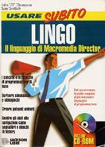

}  

  

**[home](index.md) > [publications](publications.md) > interview 1997**

JHT interview 1997  
[1994](interview1994.md) [1995](interview1995.md) 1997 [1998](interview1998.md)

  
**interview with  
john thompson  
of macromedia at  
the macromedia user  
conference asia**

**Background**

Peek beneath the hood of Macromedia Director and you find Lingo, a complete scripting language that gives the world's most popular authoring tool much of its power. While many people have worked on Lingo, one man - its chief architect, John Thompson - can be credited not just for the original vision also for developing and refining the language over the years. Authoring Media caught up with JT, as he is usually called, in Melbourne where he spoke at a number of sessions at the recent Macromedia User Conference Asia 97.

**anm: Could you tell us a little bit about your background and what led you to designing a multimedia scripting language?**

JT: I studied computer science at MIT where my main interest was in computer languages, particularly LISP which is a symbolic rather than a numerical language embodying concepts such as ease-of-use and accessibility. I really enjoyed getting into that but I also had this other desire to be expressive. I was always drawing and painting in my spare time and I hadn't done much of that since high school. So midway through college I just took some time off and went back to New York and studied drawing and painting for a year and a half. And I learnt a lot about those skills, and also saw that I could combine my interest in computer languages, computers in general, and visual expression.

So in 1981, I went back to MIT and focused on that crossover. I studied with Muriel Cooper in the Visual Language Workshop where the emphasis was on creating tools that were geared for designers rather than technicians. And at the same time I was working with ArcMac (The Architecture Machine Lab, now the MIT MediaLab) which was concerned with creating information systems that were very accessible, how to navigate through a lot of information in new and interesting ways, using large screens, multi-sensory stuff. I was drawn to that because what I felt was exciting was this issue of how can you take this very powerful computer and make it more accessible to creative people, and that's what I like to see.

**anm: When did you first join MacroMind?**

I saw some of the graphical user interface approaches that were being pioneered by the Lisa and that seemed more exciting. I was interested in art anyway, so I said hey this is probably the place to go. In 1985 I left my instructor's position at MIT to work at LucasFilm on non-linear editing systems. From there I got hooked up with Marc Canter at MacroMind through some friends of his who were working at LucasFilm. I wanted to get on to the Macintosh which I saw as a great computer so I started by doing the VideoWorks Accelerator which was a pre-QuickTime technology to play animations faster. Then I did the Paint program in Director.

Now for a while there the company was focused on a product called 3D Works and I had an opportunity just to have free reign over where Director should go, so I just plugged Lingo into Director 2.0 and again the goal was to create an environment, drawing on what I did creatively which is build a fluid tool, a tool that was expandable, was expressive and had a lot of power. And since I knew about powerful interpretive languages and how to implement them, I added a scripting language to Director.

**anm: What were your influences in developing that first version of Lingo?**

JT: The biggest influences in terms of implementation were LISP and SmallTalk and in terms of the syntax it was HyperTalk, the HyperCard scripting language, because that was the first language designed specifically for non programmers. And I admire that concept. Overall Lingo has always been a synthesis, in that it tries to take in the best of what's out there in order to get closer towards the goal of creating a powerful, expressive, accessible tool. One of the things that kills a lot of software development is that it tries to be overly ambitious and then you get a tool that's too late to address the real needs of people. I was able to avoid that by firstly having a clear vision of what was needed to go into a very accessible, high performance language. And, secondly by accepting the fact that you can only implement so much within the software development cycle.

****

Now I'd be the first to admit that Director isn't perfect but I think what we actually do extremely well is that we do iterative revisions and we listen to our customers and we systematically attempt to solve the problems that matter to them. I could go on for hours about these beautiful dreams of scalable presentation, multiple points of view of editing code, and so on, but we have to deal with the current issues of the marketplace: providing cross-platform playback, making it possible to play back content on the Web so it's a balancing act. But underlying all of that is a desire to make programming a lot more accessible and easier for non programmers.

**anm: Who then do you see as the primary audience for Director?**

JT: That's easy. It's definitely the creative professional who is not a programmer. Now we do want to provide scalable power, so we're going to put in powerful features that professional programmers can take advantage of and run with. We're not going to take that away. But the main idea is to provide a path where a creative professional can come in and, if they have the time and the skills, they'll be able to use Lingo to create new interactive experiences, because you can't get away from it, you have to script to create those experiences.

And I feel that there is a definite different type of content that you get out of somebody whose primary motivation is expression versus coding. Because what's exciting for me in multimedia is expression and that for me is philosophically very satisfying because you are enabling people who wouldn't have touched a computer before to express themselves in ways they could never have imagined.

I get a lot of thrills from coming to conferences like this and having people come up and shake my hand and say: "Thank you for creating the language or writing the book because now I can understand this stuff and I'm using it to make something." I've seen people over the years develop their careers around Director and do what they want to do and be happy about it and get paid and then grow with the tool. Even now with the Director Java solution, people can say: "Hey, I can still work in this environment that I'm very comfortable with but now when people say they need Java, I can provide a solution." So they can take advantage of the power of Java without getting into the headaches of learning a new language. That's what I like to see.

  
  

[top](#topofpage)

**.........................................**

� 2001 John Henry Thompson - site by [Pixelyze](http://www.pixelyze.com/) & [CAGE](http://www.cage.nl/)

