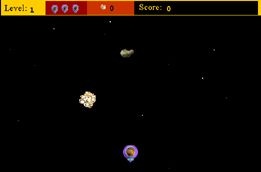

[home](index.md) > [publications](publications.md) > **[lingo](lingo.md) > lingo examples**

JHT lingo examples

interactive animations

  

**special effects**

spinning  
round &  
round &  
round...

)

)

**dance with me!**

May I  
have  
this  
dance?

**Space Corn**

Catch  
golden  
asteroids!

)

)

**Africa**

**By William Ndiaye  
**William created this movie as a learning exercise. He spent a few weeks studying Lingo and Director with my guidance and my book "The Lingo Workshop". He put his knowledge to the test by making this movie from scratch. Since it is his first movie and is not complete yet, he was reluctant to provide the source. He would like to spend more time "cleaning it up."

 

[top](#topofpage)

**.........................................**

� 2001 John Henry Thompson - site by [Pixelyze](http://www.pixelyze.com/) & [CAGE](http://www.cage.nl/)

