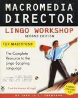

[home](index.md) > [publications](publications.md) > **[lingo](lingo.md) > lingo workshop**

JHT lingo workshop

"Macromedia Director Lingo Workshop"  
by John (JT) Thompson  
1st edition published 1995  
2nd edition published 1996

First edition of  
the "Lingo Workshop">)

**the author**

John Thompson is the principal engineer for Macromedia\[rm\] Director\[rm\], the inventor and developer of Lingo and XObjects, and a professor at New York University/Tisch Interactive Telecommunications Program, which is one of the few graduate degree programs in new media. He has been teaching interactive media using Macromedia\[rm\] Director\[rm\] since 1988 and has exhibited several interactive art pieces internationally.

Second edition of  
the "Lingo Workshop">)

**the book**

This book is a step-by-step approach to learning Lingo, the scripting language for Macromedia Director, which is the premier multimedia authoring tool. You can use Director to create interactive projects that combine text, sound, graphics, animation, and digital video. Director's Lingo scripting language gives you greater control over these multimedia elements. With Lingo, many developers have created multimedia works for education, entertainment, and business. These works can be delivered in a variety of medium for play back on Macintosh,Windows, and several other platforms. Director movies can be distributed on networks, hard drives, floppy disks, and CD-ROM. A few representative CD-ROM titles are: Total Distortion, Iron Helix, The Journeyman Project, Yearn2Learn Peanuts, Rodney Greenblat's Dazzeloids, and Macromedia's Showcase CD. On the World Wide Web there are an ever growing number of "Shocked" sites that incorporated Director movies using the freely distributed Director Shockwave Player. Thousands of these sites are listed in the Shockwave Epicenter at [http://www.macromedia.com](http://www.macromedia.com/).

This book is designed to teach Lingo to people with no prior scripting background. We assume that you know how to use Director to create animation and control the Score. Lingo concepts are introduced gradually with practical examples. Exercises and reviews are used to help build understanding and retention. Concepts are richly illustrated to promote visualization and help build understanding.

We learn best when all our senses are involved. This book has many hands-on exercises and illustrations that you can do and see in addition to reading about a concept.

Japanese translation  
of first edition>)

**acknowledgements**

I would like to thank the many people in my life that have guided me on the path that has led to the creation of this book. My parents Walter and Mabel Thompson, for having the courage and determination to travel from Jamaica to England, and then to the United States to ensure better educational opportunities for their five children. The teachers at Junior High School 80 and Bronx High School of Science that took extra time to feed my early interest in math, science, and the arts. Mr. Leo Downs for creating the after school program that gave me my first computer job.

German translation  
of second edition >)

Mr. Lowel Hawkinson my undergraduate computer science professor at MIT for sharing his enthusiasm for Lisp and giving me my for first Lisp programming job. The Media Lab, Visible Language Workshop, and Film Video departments at MIT for show me that artistic expression and engineering could be combined. Marc Cantar for giving me the freedom to incorporate Lingo into Director. Red Burns the founder and chair of the Interactive Telecommunications Program at New York University for the opportunity to teach. The Macromedia management and Director development team for maintaining a flexible and creative work place.

Sam Gottlieb and my brother Jervis Thompson for constructing the example movies and providing first user experience feed back. To Dan Sadoski, Ronnie and Nancy Sampson for their valuable comments. To the technical editors Cathy Clarke and Okera Ras I for a lot of work in a short time. Extra "thank you" to Cathy Clarke and her company, DXM Productions, for their work on the Shockwave chapter.

My dear wife, Shani Asantewaa Strothers-Thompson, and our three children, Asuo, Nile, and Rajni, for putting up with my demanding schedule developing software, teaching, and writing while traveling between Philadelphia, San Francisco, and New York.

Italian translation  
of first edition>)

**contents at a glance**

**Part 1 Click and Go  
**1\. The Playback Head 7  
2\. Your First Interactive Movie 15  
3\. Debugging Broken Scripts 35  
4\. Special Effects 39  
5\. Improving Performance 57

**Part 2 Building Blocks  
**6\. Expressions 81  
7\. Fields 97  
8\. If'Then Decisions 111  
9\. Sprite Properties 131  
10\. Variables and Lists 151  
11\. Handlers 171

**Part 3 Dynamic Animation and Interactions  
**12\. Puppet Sprites 185  
13\. Designing Your Scripts 207  
14\. Object-Oriented Scripting 223

**Part 4 Connecting to the World  
**15\. Digital Video  
16\. Lingo Xtras  
17\. Platforms  
18\. Shockwave on the Internet

**Appendix A: Checklists' 247**

[top](#topofpage)

**.........................................**

(c) 2001 John Henry Thompson - site by [Pixelyze](http://www.pixelyze.com/) & [CAGE](http://www.cage.nl/)

