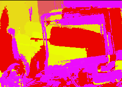

 JHT Other work  .subtitle { font-family: Courier New,Arial,Verdana,Helvetica; font-size: 16px; color: #748376; font-weight: bold } .pagetitle { font-family: Courier New,Arial,Verdana,Helvetica; font-size: 18px; color: black; font-weight: bold } .textwhite7 { font-family: Courier New,Arial,Verdana,Helvetica; font-size: 10px; color: white; } .textwhite8 { font-family: Courier New,Arial,Verdana,Helvetica; font-size: 10px; color: white; } .textwhite9 { font-family: Courier New,Arial,Verdana,Helvetica; font-size: 12px; color: white; } .bodytext { font-family: Courier New,Arial,Verdana,Helvetica; font-size: 12px; color: black; } .bodytext7 { font-family: Courier New,Arial,Verdana,Helvetica; font-size: 10px; color: black; } .bodytext8 { font-family: Courier New,Arial,Verdana,Helvetica; font-size: 10px; color: black; } .bodytext10 { font-family: Courier New,Arial,Verdana,Helvetica; font-size: 12px; color: black; } .bodytext11 { font-family: Courier New,Arial,Verdana,Helvetica; font-size: 12px; color: black; } .bodytext12 { font-family: Courier New,Arial,Verdana,Helvetica; font-size: 12px; color: black; } .bodytext14 { font-family: Courier New,Arial,Verdana,Helvetica; font-size: 14px; color: black; } .copyright { font-family: Courier New,Arial,Verdana,Helvetica; font-size: 10px; color: #748376; } .green8 { font-family: Courier New,Arial,Verdana,Helvetica; font-size: 10px; color: #748376; font-weight: bold } .green10 { font-family: Courier New,Arial,Verdana,Helvetica; font-size: 12px; color: #748376; font-weight: bold } .green12 { font-family: Courier New,Arial,Verdana,Helvetica; font-size: 12px; color: #748376; font-weight: bold } .green14 { font-family: Courier New,Arial,Verdana,Helvetica; font-size: 14px; color: #748376; font-weight: bold } .green16 { font-family: Courier New,Arial,Verdana,Helvetica; font-size: 16px; color: #748376; font-weight: bold } .green18 { font-family: Courier New,Arial,Verdana,Helvetica; font-size: 18px; color: #748376; font-weight: bold } a:link { color: #993333; text-decoration: underline; font-weight: bold; } a:active { color: #008080; text-decoration: none; font-weight: bold; } a:visited { color: #421F13; text-decoration: underline; font-weight: bold; } body { background-color: #9EA8A0; background-image: url("images/greenvidback1.jpg"); margin-top: 0; margin-left: 0; } td { font-family: Courier New,Helvetica,Arial,Verdana; font-size: 12px; color: black}  

  

**[home](index.html) > new work**

JHT new work

  
about DICE

DICE transforms the computer into a "Digital Instrument for Computed Expression." DICE a software application and an idea. As software DICE manipulates video in real-time. DICE is another realization of my dream to make the computer an accessible tool for artists. DICE is also a platform for my interactive art work.

_**The images are from video transform in DICE**_

)_Face Sun 2_

)_Redness 10_

I am fascinated by the potential of the computer as an expressive, real-time instrument. As quickly and easily as you pick up a crayon and begin to doodle or hit notes on a piano I want to play with video and sound. DICE initially focuses on the expressive possibilities of processed real-time video. That is, video feed into the computer (digitized) and then transformed and analyzed. The viewer is instantly inside the computer and knows where they are in the new space because they can see themselves on the screen or projection. Think of the ceiling to floor mirrors in a dance studio. The viewer interacts with in the new space by moving and making gestures.

)_dmi works_

DICE runs on Apple Macintosh computers and uses inexpressive video cameras. Video is digitized and feed into the computer as a stream of numbers, or pixels. The pixels are mathematically combined by DICE to create new images. Amazingly, with the right software, present day computers are fast enough to perform the millions of computations per second needed to create new images from a video stream.

)_Red-y-pur_

 [top](#topofpage)

**.........................................**

� 2001 John Henry Thompson - site by [Pixelyze](http://www.pixelyze.com/) & [CAGE](http://www.cage.nl/)

