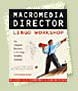
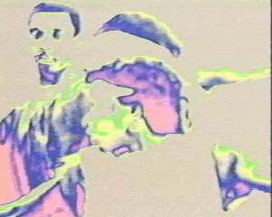

**[home](index.md) > publications**

JHT publications  
lingo [articles](#articles) [interviews](#interviews) [press kit](#presskit)

lingo  
articles  
interviews  
press kit

**lingo**

lingo workshop and interactive examples

the computer language  
 JHT invented

[Lingo](lingo.md) is the scripting language in the Macromedia Director authoring tool.

**articles**

[top](#topofpage)

Articles on computer games and learning by JHT

From humble beginnings in 1974 with a New York City affirmative action funded after-school program, John H. Thompson (MIT '83) became the author of the most widely used computer programming language in interactive media. Known worldwide as simply "JT", Thompson is the inventor and chief architect of "Lingo". Lingo is best known as the programming language used to create computer games with Macromedia's Shockwave. Lingo makes it possible for non-programmers to develop computer games. Shockwave is the primary way to present interactive games on the Internet. Over 100 million people use Shockwave.

In a continuing series of articles, Thompson discusses how to make games with positive learning challenges that rival the popularity of current video games.

[Hard Fun Part 1 - Computer Games and Learning](hardfun1.md)

[Hard Fun Part 2 - Working for Fun](hardfun2.md)

**interviews**

[top](#topofpage)

[1994 with Terry Schussler](interview1994.md)

[1995 with Lingo Users Journal](interview1995.md)

[1997 at Macromedia User Conference](interview1997.md)

[1998 with Director-Online](interview1998.md)

Interviews with  
John Henry Thompson  
over the years

**press kit**

[top](#topofpage)

JHT's print friendly material

**printable documents**

clickto print the document  
clickto open and/or save the document

resume

full bio

100 word bio

Hard Fun Part 1 - Computer Games and Learning

Hard Fun Part 2 - Working for Fun

 Lingo Workshop book description

[download all printable documents in one zip file](presskit/presskit.zip)

**images in zip files for downloading**

76KB

79KB

84KB

124KB

27KB

[top](#topofpage)

**.........................................**

� 2001 John Henry Thompson - site by [Pixelyze](http://www.pixelyze.com/) & [CAGE](http://www.cage.nl/)

