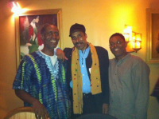
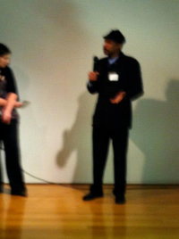
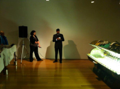

# [John Henry Thompson](../README.md)

[< Previous](2011-12-29-1.md)

   

  

[http://www.johnhenrythompson.com/z-blog-1/songclipsupdate  Updated SongClips pages. ](http://www.johnhenrythompson.com/z-blog-1/songclipsupdate)
2011-11-20

[http://www.johnhenrythompson.com/songclips-app Update description of my SongClips and added demo clips.](http://www.johnhenrythompson.com/songclips-app)
2011-11-19

   

   

[Post 945](http://www.youtube.com/watch?v=gXVV12-B3EU)
2011-10-27

[Post 946](http://front.moveon.org/this-powerful-clip-is-exactly-why-we-support-occupywallstreet/)
2011-10-26

[Another computer science pioneer passing. I remember the elegance of a lisp interpreter expressed in a few pages of lisp code. http://news.cnet.com/8301-1001_3-20125026-92/john-mccarthy-creator-of-lisp-programming-language-dies/](http://news.cnet.com/8301-1001_3-20125026-92/john-mccarthy-creator-of-lisp-programming-language-dies/)
2011-10-25

[What's possible before I reach 100?](facebook.com)
2011-10-20

[A fond farewell to another computer pioneer. http://en.wikipedia.org/wiki/Dennis_Ritchie](http://en.wikipedia.org/wiki/Dennis_Ritchie)
2011-10-14

[My practice of Ashtanga Primary Series after one year.](http://www.johnhenrythompson.com/z-blog-1/yearoneashtangaprimary130)
2011-10-03

[http://www.johnhenrythompson.com/i-choose-ashtanga Updated article - added links to individual asanas.](http://www.johnhenrythompson.com/i-choose-ashtanga)
2011-09-24

[http://www.johnhenrythompson.com/z-blog-1/day5ofashtangamysoreworkshop](http://www.johnhenrythompson.com/z-blog-1/day5ofashtangamysoreworkshop)
2011-09-23

[In My Yoga Journey added jumps into video from images of the asanas (postures). http://www.johnhenrythompson.com/yoga-journey](http://www.johnhenrythompson.com/yoga-journey)
2011-09-09

[http://www.youtube.com/watch?v=g-YiEjrvqkA "...What's up Money My name is T'Nez Me need you to buy my baby feedings ... Clasp me hands and close me eyes Money where are you when me want cloths to buy Where are you when my mother feel ill  and she can't play the bill for prescription fill..." ](http://www.youtube.com/watch?v=g-YiEjrvqkA)
2011-08-06

[http://www.youtube.com/watch?v=lVgjK5uJNPA](http://www.youtube.com/watch?v=lVgjK5uJNPA)
2011-07-13

[Next >](2011-06-15-1.md)