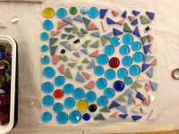
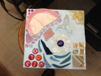
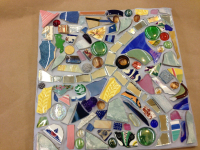
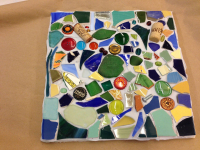
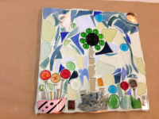
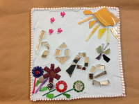
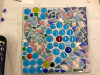
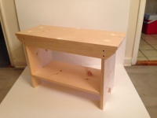
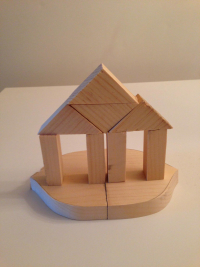
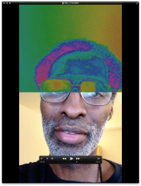

# [John Henry Thompson](../README.md)

[< Previous](2013-03-09-1.md)

   

   

 

[Mindfullness (yoga), coding (learn to program) and learning/teaching. Things that I have been working on and seeking integration.](http://www.youtube.com/watch?v=pWQGAUi8V0U)
2013-03-01

[I've been listening to a lot of Neil deGrasse Tyson lately. Here's one of my favorite series: http://www.haydenplanetarium.org/tyson/buy/videos/the-inexplicable-universe-unsolved-mysteries](http://www.haydenplanetarium.org/tyson/buy/videos/the-inexplicable-universe-unsolved-mysteries)
2013-02-28

[DICE video experiments from 2006, me and my youngest son messing around with some Capoeira moves. He's much taller now: http://www.youtube.com/playlist?list=PLTqu0aYG0uh6MD89656cgYKtrHvCiGA6c&feature=view_all](http://www.youtube.com/playlist?list=PLTqu0aYG0uh6MD89656cgYKtrHvCiGA6c)
2013-02-12

[Started online course offer my MIT Media Lab:  http://www.johnhenrythompson.com/the-art-of-learning/learning-creative-learning](http://www.johnhenrythompson.com/the-art-of-learning/learning-creative-learning)
2013-02-12

[SongClips app updated to support video. https://itunes.apple.com/us/app/songclips/id335528135?mt=8](https://itunes.apple.com/us/app/songclips/id335528135?mt=8)
2013-02-02

[http://www.johnhenrythompson.com/who-am-i](http://www.johnhenrythompson.com/who-am-i)
2013-01-28

[Next >](2012-10-12-1.md)