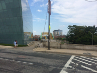
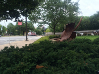
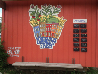
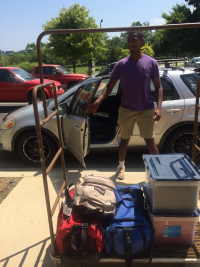
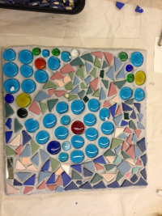
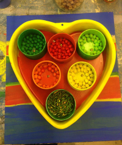
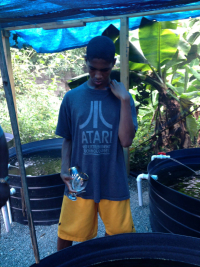
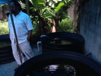
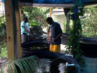
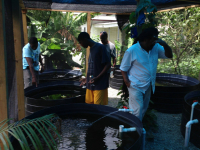

# [John Henry Thompson](../README.md)

[[ <Previous ]](2014-08-01-1.md)

   

   

[http://www.thehistorymakers.com/biography/paula-madison](http://www.thehistorymakers.com/biography/paula-madison)
2014-07-15

[http://share.shutterfly.com/action/welcome?sid=8AbtGzNozZMn6w&cid=SFLYOCWIDGET](http://share.shutterfly.com/action/welcome?sid=8AbtGzNozZMn6w&cid=SFLYOCWIDGET)
2014-05-04

[https://www.kickstarter.com/projects/1604312285/black-heirlooms-a-film-about-intergenerational-wea](https://www.kickstarter.com/projects/1604312285/black-heirlooms-a-film-about-intergenerational-wea)
2014-04-23

[Discovering an Enslaved Artist and His Masterpiece http://www.theroot.com/articles/history/2014/04/juan_de_pareja_discovering_a_slave_artist_s_masterpiece.html?wpisrc=newsletter_jcr:content&mc_cid=98b9e1d0d2&mc_eid=e7663da2fd ](http://www.theroot.com/articles/history/2014/04/juan_de_pareja_discovering_a_slave_artist_s_masterpiece.html?wpisrc=newsletter_jcr%3Acontent&mc_cid=98b9e1d0d2&mc_eid=e7663da2fd)
2014-04-23

 

[For History Month: http://www.pbs.org/wnet/african-americans-many-rivers-to-cross/ ](http://www.pbs.org/wnet/african-americans-many-rivers-to-cross/)
2014-02-12

[Post 611](http://code.org/sharecertificate)
2014-01-26

[YINKA SHONIBARE MBE: MAGIC LADDERS http://www.barnesfoundation.org/exhibitions/upcoming/shonibare/ http://nitephotosocial.smugmug.com/Events/Art-Cultural/Jan-24-2014-Opening-Party/ ](http://www.barnesfoundation.org/exhibitions/upcoming/shonibare/)
2014-01-26

[http://www.splcenter.org/get-informed/news/new-federal-guidelines-are-welcome-step-toward-stopping-school-to-prison-pipeline-](http://www.splcenter.org/get-informed/news/new-federal-guidelines-are-welcome-step-toward-stopping-school-to-prison-pipeline-)
2014-01-12

[Post 615](http://www.thefederalistpapers.org/?p=12779)
2014-01-06

[Post 616](http://www.nytimes.com/news/the-lives-they-lived/2013/12/21/red-burns/)
2013-12-27

[Almost missed Computer Science Education Week. I'll be ready next year! http://csedweek.org](http://csedweek.org/)
2013-12-13

[Keep a look out for this documentary: http://www.scribe.org/events/producersforumfreeangelaandallpoliticalprisoners](http://www.scribe.org/events/producersforumfreeangelaandallpoliticalprisoners)
2013-11-28

[Post 620](http://www.ucsusa.org/food_and_agriculture/solutions/expand-healthy-food-access/11-trillion-reward.html)
2013-09-10

   

[[ Next> ]](2013-09-02-2.md)