# [John Henry Thompson](../README.md)

[< Previous](2016-06-10-1.md)

  [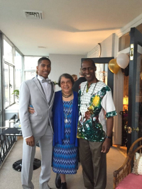](../posts/2016-06-10-29.md) [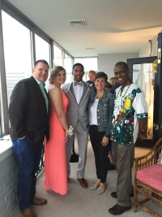](../posts/2016-06-10-30.md)

[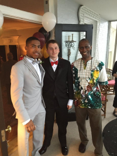](../posts/2016-06-10-31.md) [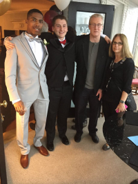](../posts/2016-06-10-32.md) [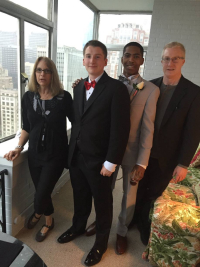](../posts/2016-06-10-33.md) [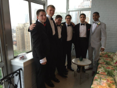](../posts/2016-06-10-34.md)

[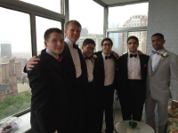](../posts/2016-06-10-35.md)

[https://www.youtube.com/watch?v=FVztZI-OMUg](https://www.youtube.com/watch?v=FVztZI-OMUg)
2016-06-03

[https://vote.usa.gov](https://vote.usa.gov/)
2016-03-07

[wikipedia's estimate of age of universe in Jul 2011 was 13.75 billion years today it is 13.799 billion years http://www.johnhenrythompson.com/z-blog-1/universeolder](http://www.johnhenrythompson.com/z-blog-1/universeolder)
2016-03-05

[Why Vote? http://www.johnhenrythompson.com/z-blog-1/whyvote Change is hard to make in America.  History motivates me to vote and encourage others.  Nov 22, 1963 (age 46) John F. Kennedy Feb 21, 1965 (age 39) Malcolm Little / Malcolm X / el-Hajj Malik el-Shabazz Feb 26, 1965 (age 26) Jimmie Lee Jackson Apr 4, 1968 (age 39) Martin Luther King, Jr. Jun 6, 1968 (age 42) Robert F. Kennedy](http://www.johnhenrythompson.com/z-blog-1/whyvote)
2016-03-05

[http://www.fastcompany.com/3046756/obama-and-his-geeks](http://www.fastcompany.com/3046756/obama-and-his-geeks)
2015-08-16

[https://www.youtube.com/watch?v=46rz6-uD_E4&index=3&list=PL_nujIbA6R4sYW-PQ0QNAu8vqJgPhUFeC](https://www.youtube.com/watch?v=46rz6-uD_E4&index=3&list=PL_nujIbA6R4sYW-PQ0QNAu8vqJgPhUFeC)
2015-07-21

[Post 579](http://www.gofundme.com/AremuUSATF2015JO/share/gfm/fb_d_5_q)
2015-07-06

[Post 582](http://bit.ly/1zFzcbK)
2014-11-21

[Click here to support  THE LAST PALENQUE  Documentary  by Michael Julian Rucker](http://www.gofundme.com/THELASTPALENQUE)
2014-10-22

[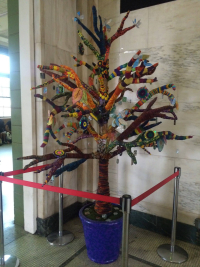](../posts/2014-08-01-1.md) [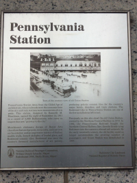](../posts/2014-08-01-2.md) [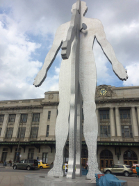](../posts/2014-08-01-3.md) [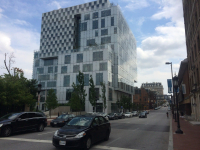](../posts/2014-08-01-4.md)

[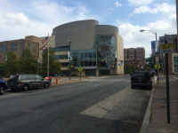](../posts/2014-08-01-5.md)  [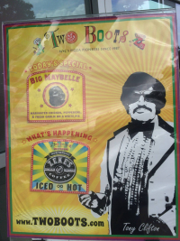](../posts/2014-08-01-7.md) [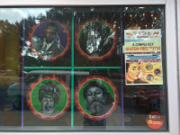](../posts/2014-08-01-8.md)

[Next >](2013-09-02-1.md)