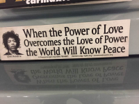
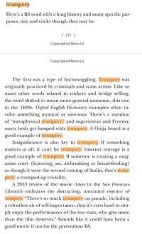
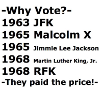

# [John Henry Thompson](../README.md)

[< Previous](2016-11-08-1.md)

[Post 401](http://www.slate.com/blogs/the_slatest/2016/10/17/federal_judge_florida_s_obscene_war_on_voting_rights_is_unconstitutional.html)
2016-10-27

[Post Hillary victory: Prepare for the continued, possible worsen, era of trumpery:  https://hbr.org/2016/10/how-to-build-an-exit-ramp-for-trump-supporters http://www.dictionary.com/browse/trumpery?s=t](https://hbr.org/2016/10/how-to-build-an-exit-ramp-for-trump-supporters)
2016-10-25

 

[From Paul Vachier: So what happened the last time the Clintons lived in the Whitehouse? The 1990s saw the longest economic expansion in the history of the United States, lasting exactly ten years from March 1991 to March 2001. It was the best performance on all accounts since the 1961-1969 period. It was also the first and last time we had a budget surplus since 1969.](https://en.wikipedia.org/wiki/1990s_United_States_boom)
2016-10-20

[trumpery A recent book cataloged all the synonyms for bullshit, and one of the oldest dates back to the 1400s. It originally referred to trickery and scamming, although its meaning has evolved to include general nonsense and insignificance. That word: trumpery. http://money.cnn.com/2016/10/17/technology/donald-trump-deception/index.html](http://money.cnn.com/2016/10/17/technology/donald-trump-deception/index.html)
2016-10-19

[...fact checkers rate Trump's statements as entirely false 52% of the time compared to Clinton's 12%... Why do people trust him? Read on...](http://money.cnn.com/2016/10/17/technology/donald-trump-deception/index.html)
2016-10-19

[Helping the next generation see the world.](https://www.gofundme.com/sjbarcelona?pc=fb_dn_postdonate_w&rcid=c5c0b4f0966411e6ac5cbc764e065880)
2016-10-19

[Make America One Again - 1956 Let's return to the original USA motto: Out of many ONE!  https://en.wikipedia.org/wiki/United_States_one-dollar_bill#History  "THE UNITED STATES OF AMERICA" spans the top of the bill, "ONE DOLLAR" is emblazoned along the bottom, and above the central "ONE" are the words "IN GOD WE TRUST," which became the official motto of the United States in 1956. Below the reverse of the Great Seal on the left side of the bill are the words "THE GREAT SEAL," and below the obverse on the right side are the words "OF THE UNITED STATES."  The eagle holds a ribbon in its beak reading "E PLURIBUS UNUM," a Latin phrase meaning "Out of many [states], one [nation]," a de facto motto of the United States (and the only one until 1956).](https://en.wikipedia.org/wiki/United_States_one-dollar_bill#History)
2016-10-18

[Next >](2016-08-13-1.md)