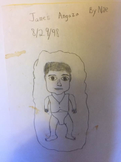
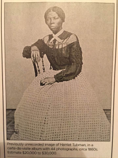
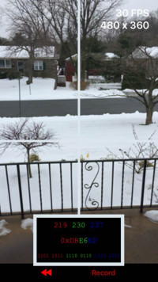

# [John Henry Thompson](../README.md)

[[ <Previous ]](2017-05-31-1.md)

[Post 331](https://goo.gl/photos/Loz3XGqUTvDX1Dp26)
2017-05-11

[Post 332](https://instagram.com/p/BTuj-dMBs6Y/)
2017-05-08

[Uncle Felix: "Art! What is Art?", here's Nari's answer:  http://www.vilcek.org/prizes/prize-recipients/2017/nari-ward.html](http://www.vilcek.org/prizes/prize-recipients/2017/nari-ward.html)
2017-05-04

[In tough times remember these stories: https://www.loc.gov/collections/slave-narratives-from-the-federal-writers-project-1936-to-1938/articles-and-essays/voices-and-faces-from-the-collection/](https://www.loc.gov/collections/slave-narratives-from-the-federal-writers-project-1936-to-1938/articles-and-essays/voices-and-faces-from-the-collection/)
2017-03-24

[http://catalogue.swanngalleries.com//full//904/728904.jpg " I Sell the Shadow to Support the Substance. "](http://catalogue.swanngalleries.com/full//904/728904.jpg)
2017-03-19

  

[Give my first photohacker workshop today at a local high school. Challenged students: when did people first begin to understand the earth to be round? They all said after Christopher Columbus - 1400's. I ask then to google: first person to estimate the circumference of the earth and find the time and place of his birth, work and death.  High lighted for me the difference between access to information and wisdom: http://www.johnhenrythompson.com/heros/professor-john-fray/thoth](http://www.johnhenrythompson.com/heros/professor-john-fray/thoth)
2017-03-10

[Feelings about learning ... http://www.johnhenrythompson.com/0-refections-on-learning](http://www.johnhenrythompson.com/0-refections-on-learning)
2017-03-07

[https://github.com/jht1900/photohacker](https://github.com/jht1900/photohacker)
2017-03-07

[For youth in the philly area: http://scribe.org/events/youth-learn-hackers-take-control-your-photos/](http://scribe.org/events/youth-learn-hackers-take-control-your-photos)
2017-03-07

[Oh sh*t! https://www.theregister.co.uk/2017/02/24/cloudbleed_buffer_overflow_bug_spaffs_personal_data/](https://www.theregister.co.uk/2017/02/24/cloudbleed_buffer_overflow_bug_spaffs_personal_data/)
2017-02-25

[We hit over 1 million!  Vote Out trumpery! https://petitions.whitehouse.gov/petition/immediately-release-donald-trumps-full-tax-returns-all-information-needed-verify-emoluments-clause-compliance](https://petitions.whitehouse.gov/petition/immediately-release-donald-trumps-full-tax-returns-all-information-needed-verify-emoluments-clause-compliance)
2017-02-17

[Fight trumpery. Vote! https://impeachdonaldtrumpnow.org](https://impeachdonaldtrumpnow.org/)
2017-02-08

[Remember this day: Jan 20, 2017 - last day of hope before entering the era of trumpery.   http://www.johnhenrythompson.com/z-blog-1/gonebutnotforgotten](http://www.johnhenrythompson.com/z-blog-1/gonebutnotforgotten)
2017-02-03

[TGIFF: Thank God is Frigging Friday! Happy birthday son. https://en.wikipedia.org/wiki/Frigg](https://en.wikipedia.org/wiki/Frigg)
2017-02-03

[Compare and contrast. President Obama's issues Dec 2016, vs. current era of trumpery (yes that's an old word). https://web.archive.org/web/20161230180222/https://www.whitehouse.gov/issues](https://web.archive.org/web/20161230180222/https://www.whitehouse.gov/issues)
2017-02-02

[Can  we get to 10 million by Feb 19? 476,329 SIGNED so far. Fight trumpery - vote! https://petitions.whitehouse.gov/petition/immediately-release-donald-trumps-full-tax-returns-all-information-needed-verify-emoluments-clause-compliance](https://petitions.whitehouse.gov/petition/immediately-release-donald-trumps-full-tax-returns-all-information-needed-verify-emoluments-clause-compliance)
2017-02-02

[The authoring tool I worked on for many years was officially retired Feb 1. 2017. Here are some artifacts from over the years. https://github.com/jht1900/macr/blob/master/director-boxes/README.md](https://github.com/jht1900/macr/blob/master/director-boxes/README.md)
2017-02-02

[[ Next> ]](2016-11-08-1.md)