# [John Henry Thompson](../README.md)

[[ <Previous ]](2017-09-13-1.md)

[http://www.johnhenrythompson.com/z-blog-1/facebooksnapshot](http://www.johnhenrythompson.com/z-blog-1/facebooksnapshot)
2017-09-12

 [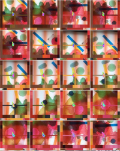](../posts/2017-09-11-1.md) [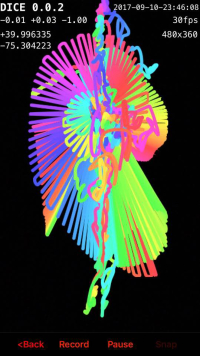](../posts/2017-09-11-2.md) [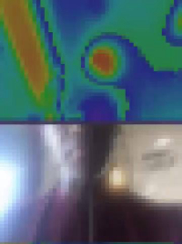](../posts/2017-09-11-3.md)

[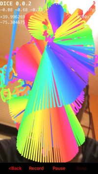](../posts/2017-09-11-4.md) [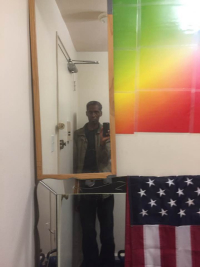](../posts/2017-09-09-2.md) [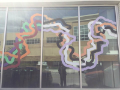](../posts/2017-09-09-3.md) [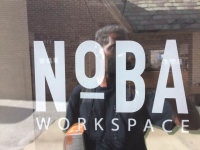](../posts/2017-09-09-4.md)

  [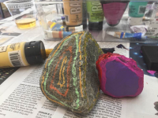](../posts/2017-09-09-7.md) [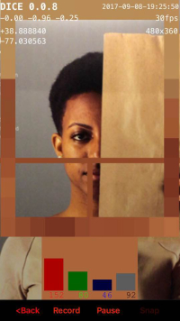](../posts/2017-09-08-1.md)

[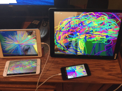](../posts/2017-09-06-1.md)

[A few years ago, we created a Garden of Interactive Delights. http://www.johnhenrythompson.com/4-garden](http://www.johnhenrythompson.com/4-garden)
2017-09-06

[<blockquote class="instagram-media" data-instgrm-captioned data-instgrm-version="7" style=" background:#FFF; border:0; border-radius:3px; box-shadow:0 0 1px 0 rgba(0,0,0,0.5),0 1px 10px 0 rgba(0,0,0,0.15); margin: 1px; max-width:658px; padding:0; width:99.375%; width:-webkit-calc(100% - 2px); width:calc(100% - 2px);">
 
 

 
 <a href="https://www.instagram.com/p/BYp8SHXhfCt/" style=" color:#000; font-family:Arial,sans-serif; font-size:14px; font-style:normal; font-weight:normal; line-height:17px; text-decoration:none; word-wrap:break-word;" target="_blank">Morning colored mind</a>
 
A post shared by John Henry Thompson (@johnhenrythompson1493) on <time style=" font-family:Arial,sans-serif; font-size:14px; line-height:17px;" datetime="2017-09-05T10:05:20+00:00">Sep 5, 2017 at 3:05am PDT</time>

</blockquote> ](https://www.instagram.com/p/BYp8SHXhfCt/)
2017-09-05

[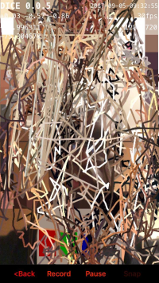](../posts/2017-09-05-2.md) [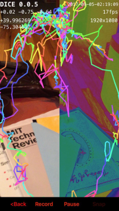](../posts/2017-09-04-1.md) [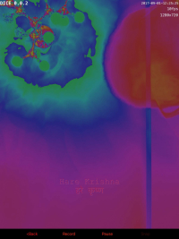](../posts/2017-09-04-2.md) [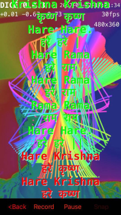](../posts/2017-09-03-1.md)

[Post 320](http://www.upworthy.com/the-forgotten-history-of-august-28-and-what-it-means-for-all-americans-today?g=2&c=ufb1)
2017-08-28

[Scroll down to see the evolution of DICE! http://www.johnhenrythompson.com/3-dice](http://www.johnhenrythompson.com/3-dice)
2017-08-28

[Preserve a cultural legacy http://www.johnhenrythompson.com/artifacts Here's an incredible effort by "Eugene Sandulenko <sev@scummvm.org>: Hi, there is an effort to implement a player for Director 2-Director 6 files in the open source ScummVM project (http://www.scummvm.org). Is there a chance that the folks could get access to the original sources for the Director Player? If needed, and NDA could be involved, but in general, they will be used for reimplementing the einging under GPLv2."](http://www.scummvm.org/)
2017-08-24

[Nari art show closing soon! http://www.lehmannmaupin.com/exhibitions/2017-06-02_nari-ward](http://www.lehmannmaupin.com/exhibitions/2017-06-02_nari-ward)
2017-08-16

[Plan to see Nari's latest nyc work before they close:   http://www.lehmannmaupin.com/exhibitions/2017-04-29_socrates-sculpture-park-new-york](http://www.lehmannmaupin.com/exhibitions/2017-04-29_socrates-sculpture-park-new-york)
2017-08-16

[Post 325](https://www.gofundme.com/duro-okera?pc=fb_dn_postdonate_r&rcid=r01-150280405933-324856eceecf43b8)
2017-08-15

[Post 330](http://m.huffpost.com/us/entry/us_592e471be4b055a197ce1e8b)
2017-05-31

[[ Next> ]](2017-01-16-1.md)