# [John Henry Thompson](../README.md)

[Back](2018-02-01-1.md)

  

[https://www.youtube.com/watch?v=dwyMOkuvlGA&t=2139s](https://www.youtube.com/watch?v=dwyMOkuvlGA&t=2139s)
2018-01-31

[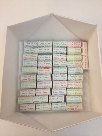](../posts/2018-01-16-1.md) [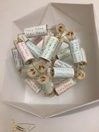](../posts/2018-01-16-2.md) [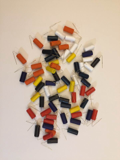](../posts/2018-01-15-1.md) [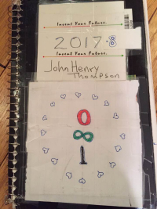](../posts/2018-01-14-1.md)

[http://www.johnhenrythompson.com/z-blog-1/diyphotoshopscribe2018-03-03](http://www.johnhenrythompson.com/z-blog-1/diyphotoshopscribe2018-03-03)
2018-01-14

[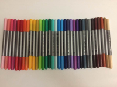](../posts/2018-01-13-1.md) [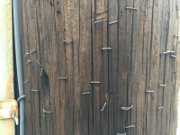](../posts/2018-01-13-2.md) 

[http://www.scribe.org/events/youth-workshop-diy-photoshop](http://www.scribe.org/events/youth-workshop-diy-photoshop)
2018-01-12

[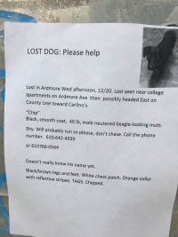](../posts/2017-12-22-1.md)  [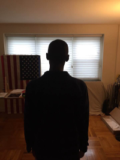](../posts/2017-12-20-1.md) [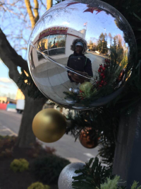](../posts/2017-12-14-1.md)

 [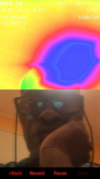](../posts/2017-12-13-2.md)

[CONGRATULATIONS everybody! We only have 2 days to fight the FCC & the repeal of #NetNeutrality! Thanks to John Oliver there's a SUPER easy way to do this. Do you enjoy Netflix? Do you find yourself spending too much time on FB? If net neutrality goes away, our Internet bills go up and we give power to companies like Comcast and Spectrum to control what information we can access. Here's what you can do - takes less than a minute. 1. Go to gofccyourself.com  (the shortcut John Oliver made to the hard-to-find FCC comment page) 2. Click on the 17-108 link (Restoring Internet Freedom) 2. Click on "+Express" 3. Be sure to hit "ENTER" (or return) on your keyboard after you put in your name, so it registers. (They make it a tad tricky there.) 4. In the comment section write, "I strongly support net neutrality backed by Title 2 oversight of ISPs. Net neutrality is the essence of how the internet was founded, not for the big corporations, but for the people, and how they interconnect. Without which we will find ourselves more limited in capacity with less freedoms which is what this country was based on. Corporatization was not what the founding fathers had in mind when they drafted the constitution of the United States." 5. Click to Review, then Submit, done. - Make sure you hit submit at the end! Copy & paste to repost this, pls., rather than ‘Share’-ing, as it will be seen by more people. (And if the "CONGRATULATIONS everybody" at the beginning confused you as it did me, it's utilizing a Facebook algorithm to make sure this post appears on more of your friends' feeds). This is one of those posts that is better to copy and paste than to share.](http://gofccyourself.com/)
2017-12-13

[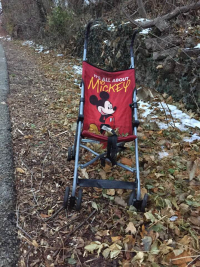](../posts/2017-12-12-1.md)  [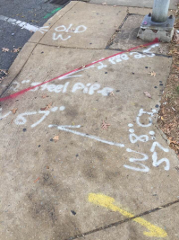](../posts/2017-12-05-1.md) [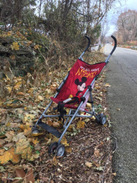](../posts/2017-12-05-2.md)

[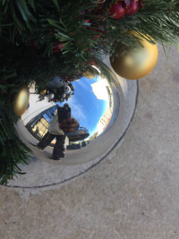](../posts/2017-12-02-1.md) [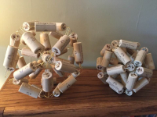](../posts/2017-11-29-1.md) [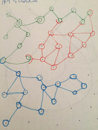](../posts/2017-11-23-1.md) [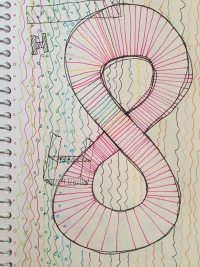](../posts/2017-11-23-2.md)

 [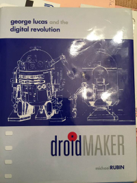](../posts/2017-11-21-2.md)

[A Man Tosses A Treat At An Orangutan. What Happens Next Has Everyone Laughing In Disbelief!](https://rumble.com/v31gw4-smart-monkey.html)
2017-11-20

[More](2017-10-17-1.md)