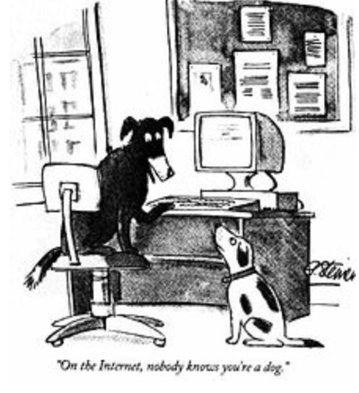

# [John Henry Thompson](../README.md)
post instagram.com

[[ <Previous ]](2017-10-18-1.md) [[ Next> ]](2017-10-12-1.md)

24 years later is it still true? "On the Internet, nobody knows you're a dog" is an adage about Internet anonymitywhich began as a cartoon caption by Peter Steiner and published by The New Yorker on July 5, 1993

2017-10-15 05:47:50

[[ <Previous ]](2017-10-18-1.md) [[ Next> ]](2017-10-12-1.md)