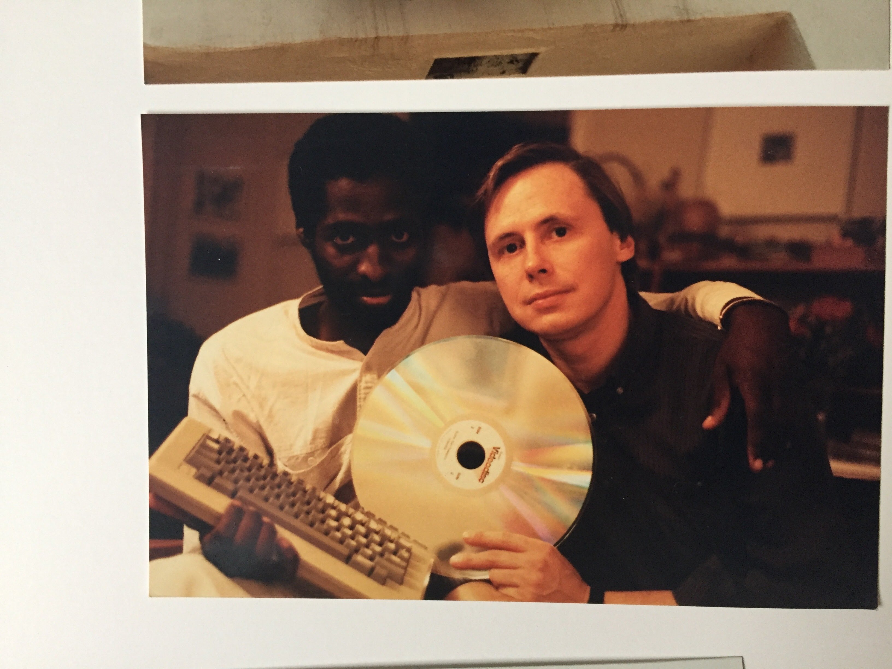
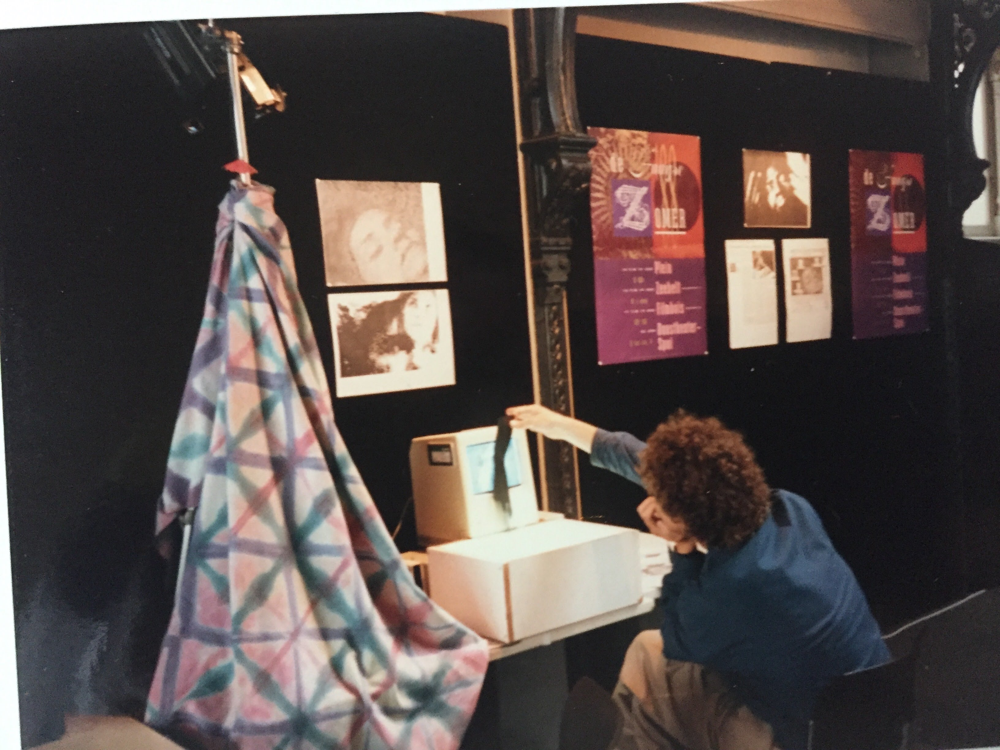
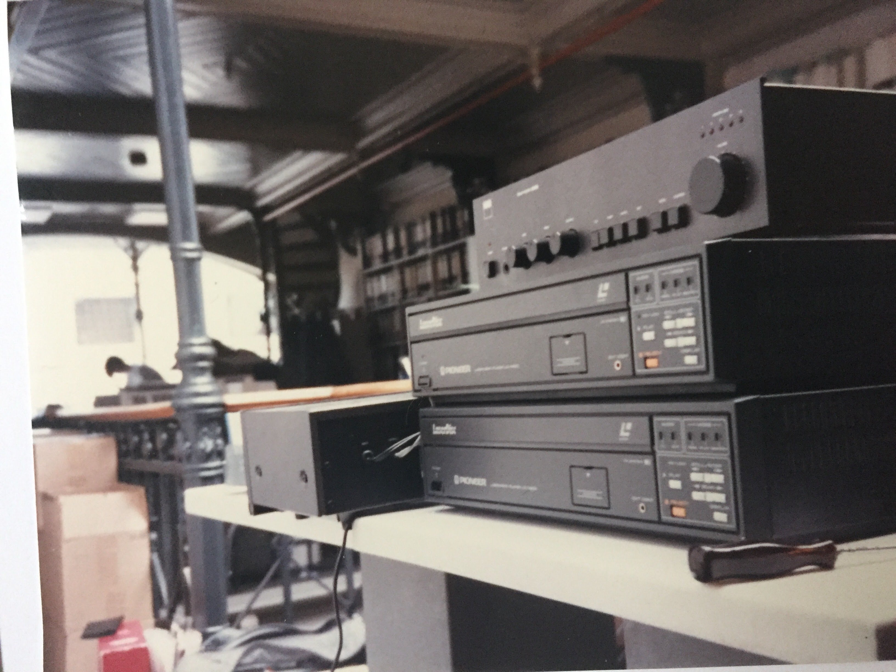

Garden - John Henry Thompson - Invent Your Future 

[John Henry Thompson - Invent Your Future](index.html)
------------------------------------------------------

Search this site

*   [About me](home.html)
    
*   [0\. Reflections](0-refections-on-learning.html)
    
*   [1\. Learn to Code](learning-to-program.html)
    
*   [2\. The Art of Learning](the-art-of-learning.html)
    
*   [3\. DICE](3-dice.html)
    
*   [4\. History](4-history.html)
    
*   [5\. Respect](heros.html)
    
*   [Artifacts](artifacts.html)
    
*   [Blog](z-blog-1.html)
    
*   Garden
    
*   [iPhone Apps](iphone-apps.html)
    
*   [Notes](notes.html)
    
*   [Photos](family.html)
    
*   [Yoga](yoga.html)
    
*   [Sitemap](system/app/pages/sitemap/hierarchy.html)
    

### Garden

Artifacts from the "Garden of Interactive Delights", 

an interactive art installation, 

created in collaboration with Benjamin Bergery. 

Included "Picture Piano", "Movie Machine", "Shadow Canvas", "Interactive Bed". 

Displayed at the Hague Summer Festival June 11 to 19, 1988.

[http://www.j4u2.com/jht/art1988.html](http://www.j4u2.com/jht/art1988.html)

  

  

  

  

  

  

  

  

  

  

  

  

  

Comments

[Sign in](https://accounts.google.com/ServiceLogin?continue=http://sites.google.com/a/johnhenrythompson.com/jht/4-garden&service=jotspot)|[Recent Site Activity](system/app/pages/recentChanges.html)|[Report Abuse](http://sites.google.com/a/johnhenrythompson.com/jht/system/app/pages/reportAbuse)|[Print Page](javascript:;)|Powered By **[Google Sites](http://sites.google.com/site)**

window.jstiming.load.tick('sjl'); window.jstiming.load.tick('jl'); sites.Searchbox.initialize( 'sites-searchbox-search-button', {"object":\[\]}\['object'\], 'search-site', {"label":"Configure search options...","url":"/system/app/pages/admin/settings"}); gsites.HoverPopupMenu.createSiteDropdownMenus('sites-header-nav-dropdown', false); JOT\_setupNav("2bd", "Navigation", true); JOT\_addListener('titleChange', 'JOT\_NAVIGATION\_titleChange', 'COMP\_2bd'); new sites.CommentPane('//docs.google.com/comments/d/AAHRpnXtRMj1XgBLQa4Y22KDIypZzMBseQwT3ox3jtLpaJLSiQF1bsln8-4GJ40pLUxiLu7fje40cpvNp3eYk2RRoAUUWp4a3P4yc34YbjoRXA6zSlLNN5GDcIN0kYpUUnl2LbjvspkHt/api/js?anon=true', false, false); setTimeout(function() { var fingerprint = gsites.date.TimeZone.getFingerprint(\[1109635200000, 1128902400000, 1130657000000, 1143333000000, 1143806400000, 1145000000000, 1146380000000, 1152489600000, 1159800000000, 1159500000000, 1162095000000, 1162075000000, 1162105500000\]); gsites.Xhr.send('http://www.johnhenrythompson.com/\_/tz', null, null, 'GET', null, null, { afjstz: fingerprint }); }, 500); window.onload = function() { if (false) { JOT\_setMobilePreview(); } var loadTimer = window.jstiming.load; loadTimer.tick("ol"); loadTimer\["name"\] = "load," + webspace.page.type + ",user\_page"; window.jstiming.report(loadTimer, {}, 'http://csi.gstatic.com/csi'); } JOT\_insertAnalyticsCode(false, false); var maestroRunner = new gsites.pages.view.SitesMaestroRunner( webspace, "en"); maestroRunner.initListeners(); maestroRunner.installEditRender(); //<!\[CDATA\[ // Decorate any fastUI buttons on the page with a class of 'goog-button'. if (webspace.user.hasWriteAccess) { JOT\_decorateButtons(); } // Fires delayed events. (function() { JOT\_fullyLoaded = true; var delayedEvents = JOT\_delayedEvents; for (var x = 0; x < delayedEvents.length; x++) { var event = delayedEvents\[x\]; JOT\_postEvent(event.eventName, event.eventSrc, event.payload); } JOT\_delayedEvents = null; JOT\_postEvent('pageLoaded'); })(); //\]\]> JOT\_postEvent('decorateGvizCharts'); JOT\_setupPostRenderingManager(); JOT\_postEvent('renderPlus', null, 'sites-chrome-main'); sites.codeembed.init();

window.jstiming.load.tick('render'); JOT\_postEvent('usercontentrendered', this);