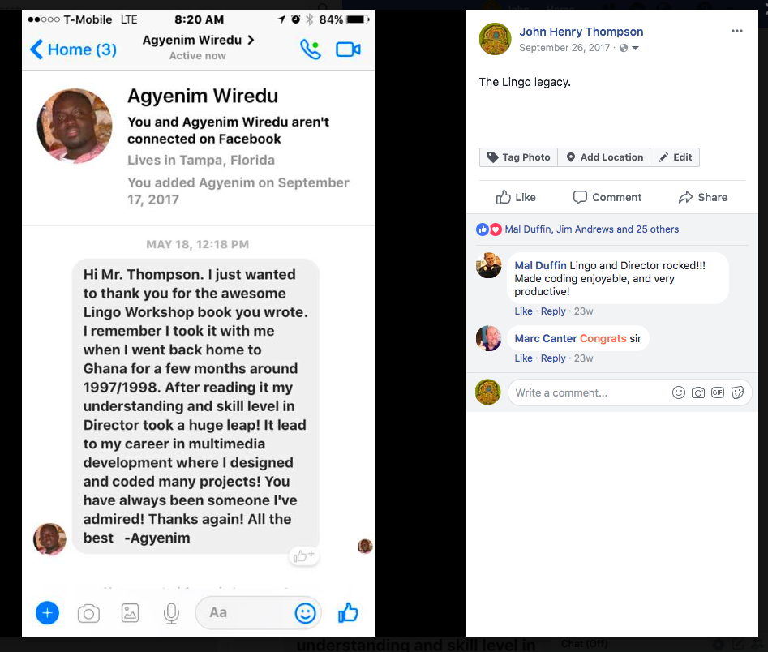

4\. History - John Henry Thompson - Invent Your Future

### 4\. History

## DICE thru the ages

**Distributed Instruments for Computed Expression** -- 2017

**Digital Instrument for Computed Expression** -- 2000

[Chatter Box Interpreter 1980's](https://github.com/jht1493/DICE-AGE/blob/master/aa/1989%20prior-art%20letter%20to%20MACR/prior_art_1989-no-sig.jpg)

Archive of John Henry Thompson's interactive art source code.

[https://github.com/jht1493/DICE-AGE](https://github.com/jht1493/DICE-AGE)

#### Subpage Listing

- [Lingo: Birth, Evolution, Demise.](4-history/lingo-birth-evolution-demise.html)

Some personal and commercial projects over the years:

[200x Collaboration with Professor John Fray](heros/professor-john-fray.html)

[200x Video Library: Yoga, Yale African American Courses, ...](http://metadeepmix.com/a2/)

[200x WebDB - W.E.B. Du Bois's Photographs Assembled for 1900 Paris Exposition ](http://metadeepmix.com/webdb/webdb/)

[2017Adobe Director (formerly Macromedia Director) Retired.](artifacts.html)

[1987 - 2004 Adobe/Macromedia Director](artifacts.html)

[1988 Garden of Interactive Delights.](4-garden.html)

###

---

Video Artifacts

###

[\[John Henry Thompson 199x ARTLIFE HQ \]](https://www.youtube.com/watch?v=kDI933bph0s&t=14s) 55:51 minutes

Presentation made to MIT Media Lab around 1997.  
Summary of my art and work on Director authoring tool  
and ideas for the future.

### [\[ John Henry Thompson Demo 1988\]](https://www.youtube.com/watch?v=9JX8_zmytqU&t=72s) 8:36 minutes

Demo video of music videos and custom visual effects

create on MIT Visible Language computer,

and MIT Film/Video Section video equipment.

Last section created on computers at the just open MIT Media Lab.

### [\[John Henry Thompson Demo 1985-03-29\]](https://www.youtube.com/watch?v=dwyMOkuvlGA&t=2139s) 53:20 minutes

Full versions of Color Dance video and other music videos.

Some videos shoot on super 8 and transferred to video.

### [\[ Shani Dance 1984 \]](https://www.youtube.com/watch?v=3fM7G5Z9JYg&t=259s) 29:59 minutes

Full version of Shani Strothers Tie-Die dance video,  
Audio experiment with processed audio.  
Spoken words are from Shani Strothers poem.  
Uncut video for Color Dance.

---

## Director Video Clips

[Macromedia Director Demo](https://www.youtube.com/watch?v=kDI933bph0s&t=8m49s)

[Total Distortion - Joe Sparks](https://www.youtube.com/watch?v=kDI933bph0s&t=11m00s)

[Kwanzaa - Okera Ras-I](https://www.youtube.com/watch?v=kDI933bph0s&t=25m48s)

---

## Macromind Inc.

[MacroMind became Macromedia and then was acquired by Adobe in 2005.](http://www.nytimes.com/2005/04/19/technology/adobe-buys-macromedia-for-34-billion.html)

What New York Times said about the 2005 acquisition:

**"Macromedia, based in San Francisco, **

**had a profit of \$41.5 million in 2004, **

**on revenue of \$370 million. **

**The company has about 1,200 workers, **

**while Adobe, with annual sales of more than \$1.7 billion, **

**employs about 3,700."**

MacroMind was founded by **Marc Canter** and his then wife

**Devorah Canter** in Chicago in the 1980's.

They moved the company to the SF Bay area in 1989

with the first round of venture funding.

The Chatter Box interpreter in prior art letter was the conceptual basis

for the **Lingo** programming language that I implemented

for the Adobe/Macromedia Director, a application for multimedia authoring.

**Lingo** started out as a dialect of **BASIC**,

evolved to a dialect of **HyperTalk** and **Smalltalk**,

and ended as a dialect of **JavaScript**.

Along the way I wrote a **Lingo** to convertor from**Java**

(with type inference) around 1997.

I added **JavaScript** as an alternative scripting option

to **Adobe Director** in 2003.

[Director History as a public git repo](https://github.com/jht1900/macr)

---

## Prior art

When I became a full time employee of **MacroMind** in **1989**

I had to list all my prior inventions since from then on any

new inventions were to be property of the company,

thus the need for this letter.

I think the legal term is prior art.

---

---

---

---

---

## Lingo Praises

Praise for Lingo received via Facebook 2017 from Minty Hunter.

Praise for Lingo received via Facebook 2017 from Agyenim Wiredu.

---

## Adobe Director Retired

[Adobe announces Director retirement](https://theblog.adobe.com/the-future-of-adobe-contribute-director-and-shockwave)

"... Sale of Adobe Director and Contribute will stop on February 1, 2017.   We will also stop ongoing updates and support for Adobe Shockwave on Mac devices on March 14th after the last release of the product.Effective April 9, 2019, Adobe Shockwave will be discontinued and the Shockwave player for Windows will no longer be available for download. ..."

Subpages (1): [Lingo: Birth, Evolution, Demise.](4-history/lingo-birth-evolution-demise.html)
