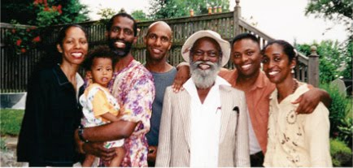

Walter Thompson Bio 

[John Henry Thompson - Invent Your Future](../index.html)
---------------------------------------------------------

    

[5\. Respect](../heros.html)‎ > ‎

### Walter Thompson Bio

I asked my father to write a bio for his grand children in 2000. Here are scans of his hand written letter describing his early life in Jamaica.

He past away in 2005, a few days before he was supposed to leave Jamaica to visit us in PA.

  

#### Dad's Bio Letter

*   [Page 1](walter-thompson-bio/page-1.html)
    
*   [Page 2](walter-thompson-bio/page-2.html)
    
*   [Page 3](walter-thompson-bio/page-3.html)
    
*   [Page 4](walter-thompson-bio/page-4.html)
    
*   [Page 5](walter-thompson-bio/page-5.html)
    
*   [Page 6](walter-thompson-bio/page-6.html)
    
*   [Page 7](walter-thompson-bio/page-7.html)
    
*   [The Baby and the Boat](walter-thompson-bio/his-stories.html)
    

  

\[Page 1\]  

Dear John,                            1/7/2000

Yours I have received ok. I am very glad to know that you are all doing fine. Thanks for the cheque and a week later I received your letter & picture. Thanks for everything. Most of all I thank you for being you. Because if you was not the person you are with all the encouragement that I was trying to give you all, that your education is the most important thing. Because once you have a good education you will be able to do most of what you want to do. As for myself I have to do do everything that I could get to do to survive. Because right now I know that my spelling is not all correct, but I always try to do the best I can. 

  

Not too long ago I apply for a sanitation job in New Rochelle. I did not pass the test. Although I know that test was supposed to be a easy test. But I didn't pass. Because from my begining first my father pass away at my age of seventeen months old, leaving five small children under the age of twelve \[in the care of my mother\].

  

In those days children do not go to school until they are seven years old. When I was six years old I told my mother that I want to go to school. So she take me to school. They keep me there for the day. The teacher told my mother that they could not take me until I was seven. Even they though I was a smart boy. I return at age six and half. This time they keep me unofficially until I was seven. I was registered officially. That meant they call my name on role call. I went \[Page 2\]  home that day as happy as can be, calling out to my mother "Mama! they start to call my name." So from then on I go to school when my mother could afford to send me until I was twelve years old.

  

During my school years I could only go to school sometimes two or three days a week. During this time I have to be helping my mother with her little business: going to Alegator pond to buy and sell fish. She also buy nut-oil that she used to boil castor oil. For most of the time she sell the oil before she buy the fish. She also bake and sell cassava bread. We then call it bammy.

  

All these things go through a lot of process. We have to parch the oil in a pot. Always a iron pot. Then pounded the hole nut into a stickey past. Then boiled until the oil start come to the surface. Then she skim the oil gradually. After skimming she then boil again. Until she gets the pure oil. Which looks like honey. Then she bottles and sell.

  

The casava bread or bammy process was not as hard. We harvest the casava root. Scrape of the outer skin. Grater it. Put it to press in a bag between two board - piece of board. Then put water on top of wood. Usually we used stones to make the weight. This pressing go on over nite. Then we pound the dry grated cassava in a wooden mortar. Mother told me that this mortar was made my Father. This mortar is made out of dugout tree trunk. After the pounding of the dry casave we sev it. Bake it \[ Page 3\] a pot. Or usually in a round iron pot we call dutchy.

  

The fish, Mother always go to the fishing village. Usually Alagator-Pond. Buy the fish from the fisher-man. Then clean the fish. Salt it. We call this process carning \[curing?\], the salt proserve the fish by preventing it from spoiling. We did not have a fredge \[fridge\] of our own.

  

At age twelve my Mother sent to to stay with a family named Mr & Mrs. Dwyer. I did not stay with this family for long. I did not like the conditions there. I did not want to just walk out on them so I advise my mother to take me back. I told her to tell this family who I was staying with that she have to take me back because my elder brother Clifford going to work and she don't have anyone else to help her. She did what I told her to do.

  

At age fourteen she send me to work with my brother Eustace's employer name Jentles. My job was to carry his lunch to anywhere on the property he was. This is Harry Jentles. I used to carry his food in a food carrier. This carrier did not maintain heat so I have to run as fast as I can so that he get his food before it get cold. He always praise me for being so fast so as to reach him while the food was still warm. I always like that.

  

At age seventeen I made application to joined the military. The Royal Air Force in England. At the time they where only taking boys 18 years or older. However \[I was only\] 17 1/2 \[years old\], a church Minister name Rev. Molings give me a recommendation stating that I was capable. The R.A.F \[ Page 4 \] send me a call card was to take the test. But to where I was living, in Lower River Lorrimers that is in the Parish of Trawlany, we did not get mail until sometime 9PM. That night when I receive the card, I did not bother to read until daylight that morning. To my surprise that was the same morning I did suppose to be  at Brown's Town Recruiting Center. That was miles away and I did not have the slightest idea how to get to Brown's Town. I suppose was to be there at 8AM. I have to go to my Brother Eustas. 

  

He was already gone to work two miles away on the property. He was the foreman he had to be at work at 7:30AM. When I reach my brother, this was already 9:30AM. He give me four shillings. He told me that the most I can do is to walk to Christiana (that was six miles away) to see if I could get transportation to Brown's Town that is in the Parish of St. Anns. When I walk to Christina six miles away the time 11:30AM and the only transport that I could get was a truck, which carry market people from Brown's Town to the Cristiana Market. That truck would not leave Christina until 6PM. I must that chance. At age 18 I could have another try at the Air Force. But the was was ended and the recruiting stop. 

  

At this I walk on 4 miles to Mandeville where my brother Clifford was. I stayed in Mandeville a little while. Then I move on to Kingston. I try to joined the Police Force. At the time they was \[ Page 5\] taking men 5 FT 8 INS tall. When they take my measurement I was 5 FT 7 1/2 INS. I was 1/2 inches short. However they said if said if I can do shorthand, typing, or driving I will have one chance of taking the test. If I fail the test the first time I must not worry to come back. I fail the test that was the end of that. 

  

Same day I wen to the military at Up Park camp. They told me that they was not recruiting at this time. So I stayed in Kingston doing odd jobs with gardner name Standford.

  

At the age of 19 I move on to St. Mary. In St. Mary I got my first real job at a government experiment farm. My job was to plant coconut leaf for shading the young plants. But because of my age, I lost that job. Because I was getting man's pay and that time I did have to be age 21 years old or more to eligible for pay that I was getting. At the time women and boy get the same pay. One day the general foreman, Mr. Ferron, said to me "Thompson, how old are you." I said "21 sir!" He said "Bring me your birth certificate, before get any more employment on this station." So I returned to Kingston doing odd jobs again. Even selling Japon. Japon is a number game own by a banker. I, who do the selling, is call a vender get pay on commission. Things was not working out so I return to St. Mary. 9 months later I was turn once again because I was unable to produce my birth certificate. So I return to Manchester. Stay sister Alice and her family (Dori's Mother). At age 24 I got a job with the Jamaica Buxsite Company. My job was to opperate a brick cutting saw machine. Soon I move on to be a furnace brick layer. I have this job for five years. Then start I start wonder if I should loose this job I may not be able to get another in Jamaica. In 1955 I decided to go to London. Within 7 month in London I send for your mother in Jamaica and marry her.

  

My life story still go on from 1955. I think you should know a little part of it. Sometime rough and tough. But the best thing that ever happen to me is my children and grand children.

  

Love you all.

Dad.

  

\[Page 7\]

Father John Henry Thompson  
 

 12.1.1887-12.24.1928  
Coley Mtn Manchester

Mother Janey Miller Thompson

 4.4.1886 - 8.7.1964  
High Gate Manchester

Self Walter Henry Thompson

 5.15.1927 - (June 2005)  
Coley Mtn Manchester

Sister Adassa T. Duncley

 4.7.1930 -  
Coley Mtn Manchester

Brother Clifford Thompson

 1.16.1925 - 12.13.1949  
Kingston

Brother Harvey Thompson

 7.16.1923 - 11.12.1940  
Lower River Trelawny

Sister Betrice T. Knight

 6.15.1920 - 10.16.1994  
Bluegate Somerset

Sister Hilda T. Surtland

 3.27.1918 - 11.1.1995  
Pembroke Hall Kingston

Brother Willie Thompson

 8.4.1916 - 6.12.78  
UK London

Brother George Thompson

 8.4.1914 - 4.2.1998  
Manchester High Gate Somerset

Brother Algon Thompson

 9.12.1912 - 4.26.1999  
Manchester Peters Field

Sister Alice T Dwyer

 2.4.1910 - 2.1.1982  
Manchester Somerset

Brother Eustace Thompson

 11.8.1908 - 12.23.1987  
Lowe River Trelawny

Sister Mary T. McLean

 2.9.1906 - 11.2.1968  
Bushy Pk. Manchester

Brother David Thompson

 1.10.1904 - 1.10.1967  
Peters Fields Manchester

Sister Georgie T. Smart

 2.3.1902 - 8.2.1944  
Race Corse Manchester

 Mother Mabel

 5.24.1934 - 6.21.1995  
Richmond St. Mary

  

  

Walter Henry Thompson, proud of his African roots.

  

The Thompson children with Walter Henry Thompson in the middle. I'm named after his father, John Henry Thompson.

  

  

Subpages (8): [Page 1](walter-thompson-bio/page-1.html) [Page 2](walter-thompson-bio/page-2.html) [Page 3](walter-thompson-bio/page-3.html) [Page 4](walter-thompson-bio/page-4.html) [Page 5](walter-thompson-bio/page-5.html) [Page 6](walter-thompson-bio/page-6.html) [Page 7](walter-thompson-bio/page-7.html) [The Baby and the Boat](walter-thompson-bio/his-stories.html)

