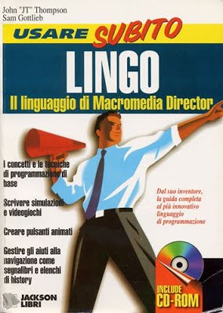

Brief Bio

[About me](../README.md)‎ > ‎

### Brief Bio

  

> Bio For Present Century - 2010's:

> I am developing [DICE: ](../3-dice.md)

> [a platform for exploring art, learning, and computer science.](../3-dice.md)

> I write [iPhone apps for EP Visual Design](../iphone-apps.md).

> I teach computer science and creative learning:

> > [• Youth Workshop: D.I.Y. Photoshop at Scribe Video Feb 2017.](http://www.scribe.org/events/youth-workshop-diy-photoshop)

> > [• Play to Learn Workshop at Scribe Video in 2014.](../the-art-of-learning/play-to-learn.md)

> > [• Play to Learn Workshop at Scribe Video in July 2013. ](../the-art-of-learning/play-to-learn/2013-edition.md)

> > [Mobile application workshop in Jamaica 2012](http://jamaica-gleaner.com/gleaner/20120504/lead/lead9.html).
> > A video [interview about the workshop](http://www.youtube.com/watch?v=Qu99hZhyhdc).
> > My vision [statement for the workshop](http://www.j4u2.com/breadfruit/workshop/vision-page/).

#### Awards:

> • [Patent 8,700,804: Methods and apparatus for managing mobile content.](http://patft.uspto.gov/netacgi/nph-Parser?Sect1=PTO1&Sect2=HITOFF&d=PALL&p=1&u=%2Fnetahtml%2FPTO%2Fsrchnum.htm&r=1&f=G&l=50&s1=8700804.PN.&OS=PN/8700804&RS=PN/8700804)

> • The Institute of Jamaica 2012 Musgrave award for Science.

#### Bio For Past Century - 1990's:

 

> My most significant contribution to the computer industry to date is the invention of the [Macromedia](http://www.macromedia.com/) [Director Lingo scripting language](http://www.macromedia.com/software/director/)

I've also helped nurture a generation of multimedia professionals as a graduate level college professor at [New York University](http://itp.nyu.edu/), and author of the "[Macromedia Director Lingo Workshop](http://www.j4u2.com/jht/lingoworkshop.html)" book.

I studied studio art at the New York Student Art League and the Boston Museum School. I earned my degree in Computer Science and Visual Studies from the [Massachusetts Institute of Technology](http://web.mit.edu/) in the 1983. After graduating, I continued at MIT as a technical instructor and developed an early color pre-press design system for the Visible Language Workshop, now part of the [MIT Media Lab](http://www.media.mit.edu/). Following this I was a project lead at Lucas Films on the EditDriod project, an early nonlinear editing system.

I have created art using 3D graphics, video disc, and real-time video processing. Some of my interactive art installations have been exhibited internationally.

My interest in both art and technology lead me to [Macromedia](http://www.macromedia.com/) (formerly MacroMind). From 1987, at Macromedia I developed a number of products, including: The VideoWorks Accelerator, VideoWorks II, MediaMaker, Action, and Macromedia Director. I created for a number of core technologies including the Lingo Scripting engine. Until I left the company in 2001, I held the position of Chief Scientist, the highest engineering position at Macromedia.

While creating multimedia tools, I was also a professor at New York University's graduate [Interactive Telecommunications Program (ITP)](http://itp.nyu.edu/). From 1988 to 1997 I developed and taught five different courses covering various aspects of interactive design and programming. Drawing upon experience teaching my Lingo scripting language, I wrote and published the book "[Macromedia Director Lingo Workshop](http://www.j4u2.com/jht/lingoworkshop.html)." The book is a popular guide to the Lingo programing language and was published in two editions and translated to Japanese, German, and Italian.

