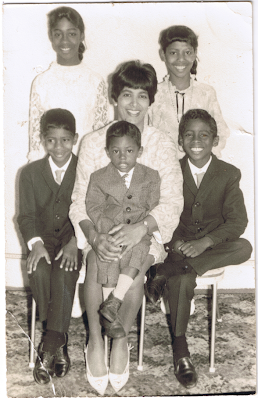

interview 2010 - John Henry Thompson - Invent Your Future 

[John Henry Thompson - Invent Your Future](../index.html)
---------------------------------------------------------

Search this site

*   [About me](../home.html)
    
*   [0\. Reflections](../0-refections-on-learning.html)
    
*   [1\. Learn to Code](../learning-to-program.html)
    
*   [2\. The Art of Learning](../the-art-of-learning.html)
    
*   [3\. DICE](../3-dice.html)
    
*   [4\. History](../4-history.html)
    
*   [5\. Respect](../heros.html)
    
*   [Artifacts](../artifacts.html)
    
*   [Blog](../z-blog-1.html)
    
*   [Garden](../4-garden.html)
    
*   [iPhone Apps](../iphone-apps.html)
    
*   [Notes](../notes.html)
    
*   [Photos](../family.html)
    
*   [Yoga](../yoga.html)
    
*   [Sitemap](../system/app/pages/sitemap/hierarchy.html)
    

[About me](../home.html)‎ > ‎

### interview 2010

John Henry Thompson Interview Questions for **Black History Month Project**:
============================================================================

From: Lynn Wanita Sexton, For Brendan Sexton. My son is a 4th grader and has been assigned to to a project on John Henry Thompson. This project counts for 3 grades and he will be doing a presentation on March 23rd, 2010 (Silver Lakes Elementary School in Miramar, FL). Do you happen to have any biography books that can assist him with this project? We have search the website for information, but there is not too much, except About.com (Inventors) and famous-black-inventors.net. My son needs to have information such as birth date, parents, siblings, where the person lived, accomplishments, occupation, and visuals for the project. He even needs to dress appropriately when represent the person he has been assigned to research on. It would be appreciated if you could lead us to some sources of information in order to present a good biography of you.
========================================================================================================================================================================================================================================================================================================================================================================================================================================================================================================================================================================================================================================================================================================================================================================================================================================================================================

**Brendan's interview questions:**  

What is your birthday?
======================

I was born 1959. I keep my full birthday date private.

What city and state were you born in?
=====================================

I was born in Hackney, England.

Describe your childhood home and where it was.
==============================================

From when I was about 1 years old, I lived in the countryside of Jamaica, West Indies, on a farm with my Aunt and her children. The life on the farm was very simple: no running water, no electricity. I remember the sunshine, the home cooked food, and the farm animals: goats, chicken and donkeys. One day while riding on a donkey, something scared the donkey and he ran off with my sister and me. When I was about 5 years old, my sisters and brother, re-joined our parents in Essex, England. England was very cold. Boys were required to wear shorts, even in the cold of winter. We lived in a two-story home with a back yard. I grew lettuce and tomatoes in our back yard garden. At age 12, the entire family moved to Brooklyn, New York, USA. My family shared an apartment with an Uncle. The apartment was near the elevated train. The train was very noisy.

Where did you grow up and what was it like there?
=================================================

From grade 6 until grade 12, I lived in apartments in New York City. When my family first came to the USA we lived in Brooklyn, then the Bronx and finally Apt. 2F in 409 Edgecombe Ave in Harlem. My Uncle was the superintendent and he lived with his children in the apartment below us in Apt. 1F. In the 1920’s Harlem Renaissance, 409 Edgecombe Ave was the home of many famous African-Americans. The nickname for the neighborhood is “Sugar Hill.” The apartment building over looked Yankee Stadium and the Polo Grounds, a very large housing project.

As a child, did you have pets? Were any special to you?
=======================================================

In England we had a cat, and a pet dog, called Tiny. Tiny ran away one day and I was very sad. Later, sometimes my siblings would mention his name and I would cry.

What did you enjoy doing as a child?
====================================

When I was in elementary school I enjoyed building things and drawing. I built homemade kites and boats. I designed of cars based on the brochures my father brought home from his job at Ford Motor Company. In middle school I was interested in electricity, I built electric motors, a projector, and a wire less radio. I entered my 7th grade Science Fair with a quiz device that I designed and built. It had lights and card slots for multiple-choice questions. You would answer a question by choosing an answer card, A, B, or C, and putting it into the question slot. If the answer was correct the light would go on. My favorite magazine was “Popular Mechanic.” I enjoying going to the library and reading science fiction, books on electricity, and books on drawing.

What was your favorite outdoor activity?
========================================

I enjoyed riding my bike around Central Park.

What were your earliest memories?
=================================

My earliest memories were living on the farm in Jamaica with my siblings and cousins. I remember my first class room in Jamaica. Several grades were in one room. We used slate boards to do our work. The slate was a small piece of black board, which had to be erased for new work. One time I was disappointed to have to erase my work since I had gotten all the math problems correct. We had to take our lunch to school and some times some milk. We’d try to run really hard and shake the milk bottle hoping to turn it to cream.

What is the name of your parents?
=================================

Walter and Mabel Thompson. My Mother passed away in 1995, and my Father in 2005.

Describe your parents. What were they like? What did they do?
=============================================================

Where did your father work? What is your strongest image of your father?
========================================================================

My father worked at the Ford Motor Company as a painter. He also worked part time as a cab driver. My father emphasized the importance of seeking education, no matter what your circumstance.

Did your mother have a job? What is your favorite memory of her?
================================================================

My mother was employed as a Nurse’s Aid in a home for the elderly. My mother enjoyed providing great home cooked meals for her family and joking around. One Halloween she went to work dressed as soldier.

Did you have any siblings and if so what were their names?
==========================================================

I have two younger brothers: Joseph, and Jervis. Jervis teaches digital media at Drexel University. His web site is www.jervo.com. I have two older sisters, Judith and Jennifa.

Describe your grandparents. What did you enjoy the most about them?
===================================================================

My grand parents passed away before I could meet them.

Who were some of your friends growing up? Are you still friends with them today?
================================================================================

I still keep in touch with one friend from high school. My friends from earlier grades I have lost touch with.

Did your friends ever get you in trouble when you were younger?
===============================================================

I never got in trouble with my friends. My friends and I would mostly go to the library and play in the parks.

What were some of your chores and did you get and allowance as a kid?
=====================================================================

My daily chore was to clean the stove and take out the trash. I did not get an allowance, but my parents would provide for me whenever I asked. I started working part time after school and full time during the summer beginning in 9th grade, at which point I paid for most of my expenses.

What schools and colleges did you go to?
========================================

I went to Junior High School 80 in the Bronx and Bronx High School of Science. I graduated with a degree in computer science, with a minor in visual arts, from MIT in 1983. I also studied studio art, life drawing and painting, at the Art Student League in New York City in the early 1980’s.

I’ve taught graduate classes at NYU/ITP and undergraduate classes at Drexel University in the late 1980’s and 1990’s.

In the late 1980’s I studied Capoeira, an Afro-Brazilian martial art/dance, with Mestre Marcelo of mandinga.com in Oakland CA.

I currently take yoga classes regularly at Dhyana Yoga, Main Line Ardmore PA.

What were some of your jobs or occupations? What made you get into the computer field?
======================================================================================

I was very interesting in electricity in middle school, this developed into an interest in computers. I read an article in “American Scientific” that explain the inner workings of calculator. I was fascinated by the number of steps a calculator had to take to add two numbers. I was also intrigued by the popular theme in science fiction of computers becoming smarter than humans. I had a goal to learn how computers worked, similarly to my first early quest to understand electricity. Though a series of events I was able develop a deep understand of computers before graduating high school.

A key event started with my 9th grade math teacher, Mr. Donald Cutler. He reasoned that it made more sense to teach 9th year algebra immediately followed by 11th grade trigonometry. He accelerated the 9th grade algebra work so that we could cover what is normally a full year of algebra in half the year, and take the state regents test in December. In the second half of the year we completed 11th grade trigonometry and took the state test of it in June. When I was accepted into the Bronx High School of Science for 10th grade, I learned that they had a computer class, but it was only open to 11th graders. I went to the math department and explain that I already had 11th grade math. I was able to add the computer class by giving up my lunch period.

My 10th grade math teacher, Ms. Schwartz, help me with the next step on my journey. I let her know I was seeking an after school job, she then introduced me to the Youth Opportunity Program, run by the state of New York. It was designed to give high school student meaningful work experience. I was accepted into the program and started working in the computer center at the New York State Psychiatric Institute mid-way through 10th grade. I was employed as a part time computer operator, which meant putting computer cards in the computer and folding the printed output, not programming. But the job was easy enough to do and leave me with enough time to learn other computer languages and do my school home work. It was a dream come thru for me, I was learning and getting paid. Even better I was only two train stops from my home and during the summer I was employed full time.

My next big break came just before I graduated high school. I wanted use the computer programming skills I had developed to get employed as a computer programmer and earn enough money during the summer help pay for my first year college expense. One of the research scientists who used the computer center offer me a job to write data management and statistical programs the summer before I went away to college. In addition to graduating from high school I had graduated from computer operator to computer programmer.

What are some of your accomplishments?
======================================

What is something that you are really proud of and why?
=======================================================

I am proud of the software products that I have created and teaching. I worked on the Adobe Director software for many years. My main contribution to it was the development of the Lingo programming language. The language was designed to be easy to learn, and it was the first programming language for many creative professionals (writers, artists, animators). I also taught for several years at the New York University Interactive Telecommunications Graduate Program. I enjoyed helping others learn how to express them selves on the computer.

What did you like to do in your free time as a kid? What do you do in your free time now?
=========================================================================================

As a kid I enjoyed drawing, building things, gymnastics, and martial arts. Now I like to continue learning about science and practice yoga.

What were some of the crazy fads you or your friends went through?
==================================================================

In high school I had one of the largest afros.

Did you admire a famous person or have an idol? What made them admirable?
=========================================================================

I admired Leonardo da Vinci because he invented cool stuff and he was a great artist.

Are you married and if so, how did you meet your spouse?
========================================================

What are some of your fondest memories with your spouse?
========================================================

I am not married.

What are some of your favorites? (color, food, ice cream, book, movie, song, sport, holiday)
============================================================================================

I like Mexican and Indian food. I like Indian Kirtan music, like Krishna Das.

Is there something you wish you could do over again? Is there something you would still like to do in life?
===========================================================================================================

I don’t find it useful to regret the past. I try to learn from my past. Today I’m practice yoga to help balance out all the time I spend sitting at the computer.

What things do you find yourself doing that you said you'd "never" do?
======================================================================

I can’t recall planning to “never” do something. I focused on dreaming about the things I’d like to do.

Tell me about a memorable moment in your life; a time you will never forget.
============================================================================

What are some of the changes in our society that you have seen in your lifetime?
================================================================================

What great historical events you have experienced in your lifetime?
===================================================================

The election of President Barack Obama was one of the most memorable moments in my life.

What are the goals you are still working toward?
================================================

My life long goal is to development my mind, body and spirit to its fullest potential, and along the way shared what I’ve learned with others.

When people look back at your life, how do you want to be remembered?
=====================================================================

I would like to be remembered for helping others realize their dream, as many have helped me.

Web references
==============

[My videos on youtube.com/user/jht1900](http://www.youtube.com/user/jht1900)

[My other website www.j4u2.com ](http://www.j4u2.com/)

[“NYU/ITP Black Genius Award 1997” video ](http://www.youtube.com/jht1900#p/u/8/9OesTbXh5us)

[Jervis Thompson - my little bro](http://www.jervo.com/blog/dalingokid/)

  

From top left, my sisters Judith and Jennifa. From the middle left, my brother Joseph, my mother Mabel with my little brother [Jervis](http://www.jervo.com/blog/dalingokid/), and me, John Henry Thompson. 

  

Comments

[Sign in](https://accounts.google.com/ServiceLogin?continue=http://sites.google.com/a/johnhenrythompson.com/jht/home/interview-2010&service=jotspot)|[Recent Site Activity](../system/app/pages/recentChanges.html)|[Report Abuse](http://sites.google.com/a/johnhenrythompson.com/jht/system/app/pages/reportAbuse)|[Print Page](javascript:;)|Powered By **[Google Sites](http://sites.google.com/site)**

window.jstiming.load.tick('sjl'); window.jstiming.load.tick('jl'); sites.Searchbox.initialize( 'sites-searchbox-search-button', {"object":\[\]}\['object'\], 'search-site', {"label":"Configure search options...","url":"/system/app/pages/admin/settings"}); gsites.HoverPopupMenu.createSiteDropdownMenus('sites-header-nav-dropdown', false); JOT\_setupNav("2bd", "Navigation", true); JOT\_addListener('titleChange', 'JOT\_NAVIGATION\_titleChange', 'COMP\_2bd'); new sites.CommentPane('//docs.google.com/comments/d/AAHRpnXtRMj1XgBLQa4Y22KDIypZzMBseQwT3ox3jtLpaJLSiQPRARAt8td5EtIv5jtqLTEiTPajUoR-tDaOMaWbYZUKTUrfbPHGUBxNeh07YsVpG5TRdjHuIwLEf99n45wkx7Vgg6jP1/api/js?anon=true', false, false); setTimeout(function() { var fingerprint = gsites.date.TimeZone.getFingerprint(\[1109635200000, 1128902400000, 1130657000000, 1143333000000, 1143806400000, 1145000000000, 1146380000000, 1152489600000, 1159800000000, 1159500000000, 1162095000000, 1162075000000, 1162105500000\]); gsites.Xhr.send('http://www.johnhenrythompson.com/\_/tz', null, null, 'GET', null, null, { afjstz: fingerprint }); }, 500); window.onload = function() { if (false) { JOT\_setMobilePreview(); } var loadTimer = window.jstiming.load; loadTimer.tick("ol"); loadTimer\["name"\] = "load," + webspace.page.type + ",user\_page"; window.jstiming.report(loadTimer, {}, 'http://csi.gstatic.com/csi'); } JOT\_insertAnalyticsCode(false, false); var maestroRunner = new gsites.pages.view.SitesMaestroRunner( webspace, "en"); maestroRunner.initListeners(); maestroRunner.installEditRender(); //<!\[CDATA\[ // Decorate any fastUI buttons on the page with a class of 'goog-button'. if (webspace.user.hasWriteAccess) { JOT\_decorateButtons(); } // Fires delayed events. (function() { JOT\_fullyLoaded = true; var delayedEvents = JOT\_delayedEvents; for (var x = 0; x < delayedEvents.length; x++) { var event = delayedEvents\[x\]; JOT\_postEvent(event.eventName, event.eventSrc, event.payload); } JOT\_delayedEvents = null; JOT\_postEvent('pageLoaded'); })(); //\]\]> JOT\_postEvent('decorateGvizCharts'); JOT\_setupPostRenderingManager(); JOT\_postEvent('renderPlus', null, 'sites-chrome-main'); sites.codeembed.init();

window.jstiming.load.tick('render'); JOT\_postEvent('usercontentrendered', this);