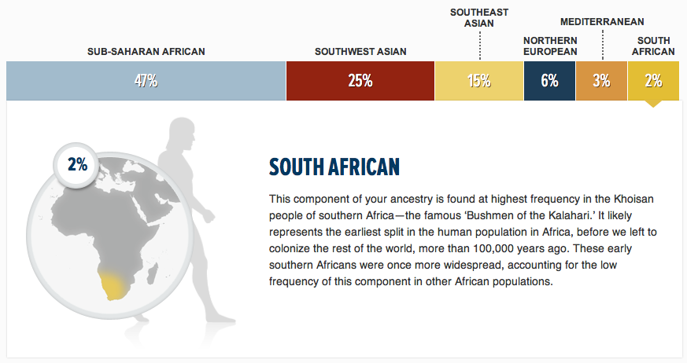

Ancestors - John Henry Thompson - Invent Your Future 

[John Henry Thompson - Invent Your Future](../index.html)
---------------------------------------------------------

    

[About me](../home.html)‎ > ‎

### Ancestors

My results from DNA analysis performed using Geno 2.0 kit by [https://genographic.nationalgeographic.com](https://genographic.nationalgeographic.com)

Of course this analysis is just one component of the great mystery of what makes me.

"**We are all more than the sum of our parts**, but the results below offer some of the most dramatic and fascinating information in your Geno 2.0 test. In this section, we display your affiliations with a set of nine world regions. This information is determined from your entire genome so we’re able to see both parents’ information, going back six generations. Your percentages reflect both recent influences and ancient genetic patterns in your DNA due to migrations as groups from different regions mixed over thousands of years..."  

  

  
  

  
  

  
  

  
  

  
  

  
  
**MATERNAL LINE**  

**M37e2**  
People with this lineage traveled from Africa across the Horn of Africa to Asia. This crossing marked the start of a long coastal migration eastward across West and South Asia. Travelers eventually reached all the way to Australia and Polynesia. It was one of the first successful expansions of modern humans out of Africa, and these intrepid travelers are the forebears of many world populations.  
  
Although this line is part of populations at high frequencies east of the Arabian Peninsula (about 15 percent), members of this group are almost entirely absent in the Levant. To the north, in Central Asia, this line is part of the populations at moderate frequencies in Central Asia, around 10 to 15 percent.  
  
This lineage is prevalent among populations living in the southern parts of Pakistan and northwest India, where it is 30 to 50 percent of the population. However, in the Indus Valley, this branch has a low frequency and a high level of diversity, indicating that the lineage in this area is the legacy of early Paleolithic settlers who were later partly replaced by more recent arrivals.  
  
**PATERNAL LINE  
E-CTS10652**  
The common direct paternal ancestor of all men alive today was born in Africa around 140,000 years ago. He was neither the first human male nor the only male alive in his time. He was the only male whose direct lineage is present in current generations. Most men, including your direct paternal ancestors, trace their ancestry to one of this man’s descendants.  
  
Your branch of this lineage was born in West Africa about 25,000 years ago when the land was fertile. With the drying of the Sahara, your ancestors migrated south into sub-Saharan Africa. More recently, some of your relatives took part in the spread of Bantu culture across much of Southern Africa.  
  
  
  
  

Comments

[Sign in](https://accounts.google.com/ServiceLogin?continue=http://sites.google.com/a/johnhenrythompson.com/jht/home/who-am-i&service=jotspot)|[Recent Site Activity](../system/app/pages/recentChanges.html)|[Report Abuse](http://sites.google.com/a/johnhenrythompson.com/jht/system/app/pages/reportAbuse)|[Print Page](javascript:;)|Powered By **[Google Sites](http://sites.google.com/site)**

window.jstiming.load.tick('sjl'); window.jstiming.load.tick('jl'); sites.Searchbox.initialize( 'sites-searchbox-search-button', {"object":\[\]}\['object'\], 'search-site', {"label":"Configure search options...","url":"/system/app/pages/admin/settings"}); gsites.HoverPopupMenu.createSiteDropdownMenus('sites-header-nav-dropdown', false); JOT\_setupNav("2bd", "Navigation", true); JOT\_addListener('titleChange', 'JOT\_NAVIGATION\_titleChange', 'COMP\_2bd'); new sites.CommentPane('//docs.google.com/comments/d/AAHRpnXtRMj1XgBLQa4Y22KDIypZzMBseQwT3ox3jtLpaJLSiQOpWXnLZWi6ACfhW0DYjVS6RiBhq49tYJYINZqW9YWUpansymrFK\_lBoDzfWX3uQK34ccz2dMHWbvra1DlFX\_wB2BYRT/api/js?anon=true', false, false); setTimeout(function() { var fingerprint = gsites.date.TimeZone.getFingerprint(\[1109635200000, 1128902400000, 1130657000000, 1143333000000, 1143806400000, 1145000000000, 1146380000000, 1152489600000, 1159800000000, 1159500000000, 1162095000000, 1162075000000, 1162105500000\]); gsites.Xhr.send('http://www.johnhenrythompson.com/\_/tz', null, null, 'GET', null, null, { afjstz: fingerprint }); }, 500); window.onload = function() { if (false) { JOT\_setMobilePreview(); } var loadTimer = window.jstiming.load; loadTimer.tick("ol"); loadTimer\["name"\] = "load," + webspace.page.type + ",user\_page"; window.jstiming.report(loadTimer, {}, 'http://csi.gstatic.com/csi'); } JOT\_insertAnalyticsCode(false, false); var maestroRunner = new gsites.pages.view.SitesMaestroRunner( webspace, "en"); maestroRunner.initListeners(); maestroRunner.installEditRender(); //<!\[CDATA\[ // Decorate any fastUI buttons on the page with a class of 'goog-button'. if (webspace.user.hasWriteAccess) { JOT\_decorateButtons(); } // Fires delayed events. (function() { JOT\_fullyLoaded = true; var delayedEvents = JOT\_delayedEvents; for (var x = 0; x < delayedEvents.length; x++) { var event = delayedEvents\[x\]; JOT\_postEvent(event.eventName, event.eventSrc, event.payload); } JOT\_delayedEvents = null; JOT\_postEvent('pageLoaded'); })(); //\]\]> JOT\_postEvent('decorateGvizCharts'); JOT\_setupPostRenderingManager(); JOT\_postEvent('renderPlus', null, 'sites-chrome-main'); sites.codeembed.init();

window.jstiming.load.tick('render'); JOT\_postEvent('usercontentrendered', this);