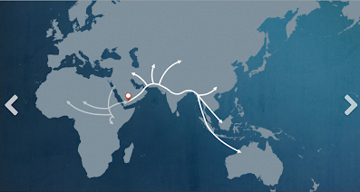

What my mother's genes says about me 

[Notes](../notes.md)‎ > ‎

### What my mother's genes says about me

posted Nov 26, 2012, 12:52 PM by John Henry Thompson   \[ updated Jan 31, 2013, 3:02 AM \]

According to https://genographic.nationalgeographic.com  
  

  
BRANCH: L3  
AGE: 70,000 YEARS AGO  
LOCATION OF ORIGIN: EAST AFRICA  
  
BRANCH: M  
AGE: ABOUT 50,000 YEARS AGO  
LOCATION OF ORIGIN: ASIA OR AFRICA  
  
"While L3 individuals are found all over Africa, L3 is important for its movements north. Your L3 ancestors were significant because they are the first modern humans to have left Africa, representing the deepest branches of the tree found outside of that continent."  
  
"Other L3 individuals, your ancestors, kept moving northward, eventually leaving the African continent completely. These people gave rise to two important haplogroups that went on to populate the rest of the world."  
  
"Your haplogroup, M, constitutes the other group that split off from L3, and gave rise to the first wave of modern humans to make a successful exodus from Africa."  
  
"Haplogroup M is considered an east Eurasian lineage, as it is found at high frequencies east of the Arabian Peninsula."  

