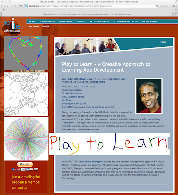

Play to Learn 

[John Henry Thompson - Invent Your Future](../index.html)
---------------------------------------------------------

    

[2\. The Art of Learning](../the-art-of-learning.html)‎ > ‎

### Play to Learn

Second Edition 2014:  
  
Play to Learn - A Creative Approach to Learning App Development  
DATES: Tuesdays, January 28, February 4, 11, 18;  
TIME: 7:00PM - 9:00PM; WINTER 2014  
Instructor: John Henry Thompson  
Workshop Location: Scribe Video Center  
4212 Chestnut Street  
3rd Floor  
Philadelphia, PA 19104  
Fee: $100. Includes 8 hours of individual lab time  
  
[Click here to visit scribe.com for workshop location and cost.](http://scribe.org/workshops/playlearncreativeapproachlearningappdevelopment0)  
  

[**Week 1:**](play-to-learn/week-01.html)  
The Creative Learning Approach  
Introduction to Scratch  
Creating Scratch projects.  
Re-mixing and Exploring  
  
[**Week 2:**](play-to-learn/play-to-learn---week-02.html)  
Review of Scratch projects  
Creative Programming at khanacademy.org/cs  
Introduction to JavaScript at khanacademy.org/cs  
  
[**Week 3:**](play-to-learn/play-to-learn---week-03.html)  

Review khanacademy.org projects  

Introduction to programming in the Browser with JavaScript and Canvas  
  

[**Week 4:**](play-to-learn/play-to-learn---week-04.html)  

Review programming in the Browser with JavaScript and Canvas  

Present favorite projects

  
  

  

  

  
  
  
  
  

  
  

  

  

Subpages (5): [2013 Edition](play-to-learn/2013-edition.html) [Play To Learn - Week 01](play-to-learn/week-01.html) [Play To Learn - Week 02](play-to-learn/play-to-learn---week-02.html) [Play To Learn - Week 03](play-to-learn/play-to-learn---week-03.html) [Play To Learn - Week 04](play-to-learn/play-to-learn---week-04.html)

