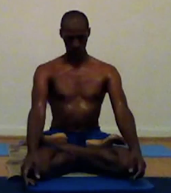

I Choose Ashtanga (2008) - John Henry Thompson - Invent Your Future   
    

[Yoga](../yoga.md)‎ > ‎

### I Choose Ashtanga (2008)

[President Kennedy's moon speech](http://www.historyplace.com/speeches/jfk-space.htm): 

**We choose to go to the moon. We choose to go to the moon in this decade and do the other things, not because they are easy, but because they are hard..."**

[David Garrigues](http://www.davidgarrigues.com/) wrote: "[If you chose Ashtanga you chose to fight.](http://davidgarrigues.tumblr.com/post/4031218381/if-you-chose-ashtanga-you-chose-to-fight)" Made me think: How I did I come to settle on a regular Ashtanga yoga practice and why?  

  

I choose to physically, mentally, and spiritually challenge myself to sweat, observe, learn, and grow. I choose a journey in Self study.  

  

The Ashtanga Primary Series is a  sequence of  postures (asanas) practiced on a regular basis with specific breath,  internal locks (Bandhas), and visual focus (Drishti). It is the first of several series in  Ashtanga Yoga, founded by [K. Pattabhi Jois](http://kpjayi.org/biographies/k-pattabhi-jois).  
  
[I plan to record my practice every 3 months.](videos.md) Below is my rendition broken down by individual asansa. The video was recorded December 2010, after first 3 months of regular practice. [Other videos at this link.](videos.md)  
  
[Samasthiti  "Standing"](http://www.youtube.com/watch?v=bIoiPerB8_Y&cc_load_policy=1#t=0m0s)  
[Surya Namaskara A #1  "Sun Salutation A"](http://www.youtube.com/watch?v=bIoiPerB8_Y&cc_load_policy=1#t=0m5s)  
[Surya Namaskara A #2](http://www.youtube.com/watch?v=bIoiPerB8_Y&cc_load_policy=1#t=0m5s)  
[Surya Namaskara A #3](http://www.youtube.com/watch?v=bIoiPerB8_Y&cc_load_policy=1#t=0m36s)  
[Surya Namaskara A #4](http://www.youtube.com/watch?v=bIoiPerB8_Y&cc_load_policy=1#t=01m16s)  
[Surya Namaskara A #5](http://www.youtube.com/watch?v=bIoiPerB8_Y&cc_load_policy=1#t=01m53s)  
[Surya Namaskara B #1 "Sun Salutation B"](http://www.youtube.com/watch?v=bIoiPerB8_Y&cc_load_policy=1#t=3m23s)  
[Surya Namaskara B #2](http://www.youtube.com/watch?v=bIoiPerB8_Y&cc_load_policy=1#t=4m28s)  
[Surya Namaskara B #3](http://www.youtube.com/watch?v=bIoiPerB8_Y&cc_load_policy=1#t=5m25s)  
[Surya Namaskara B #4](http://www.youtube.com/watch?v=bIoiPerB8_Y&cc_load_policy=1#t=6m26s)  
[Surya Namaskara B #5](http://www.youtube.com/watch?v=bIoiPerB8_Y&cc_load_policy=1#t=7m23s)  
[Samasthiti "Standing"](http://www.youtube.com/watch?v=bIoiPerB8_Y&cc_load_policy=1#t=8m31s)  
[Padangusthasana "Foot Big Toe Posture"](http://www.youtube.com/watch?v=bIoiPerB8_Y&cc_load_policy=1#t=8m39s)  
[Padahastasana "Foot To Hand Posture"](http://www.youtube.com/watch?v=bIoiPerB8_Y&cc_load_policy=1#t=9m09s)  
[Utthita Trikonasana Right "Extended Triangle Posture"](http://www.youtube.com/watch?v=bIoiPerB8_Y&cc_load_policy=1#t=9m45s)  
[Utthita Trikonasana Left](http://www.youtube.com/watch?v=bIoiPerB8_Y&cc_load_policy=1#t=10m10s)  
[Parivritta Trikonasana Right "Revolved Triangle Posture"](http://www.youtube.com/watch?v=bIoiPerB8_Y&cc_load_policy=1#t=10m26s)  
[Parivritta Trikonasana Left](http://www.youtube.com/watch?v=bIoiPerB8_Y&cc_load_policy=1#t=11m31s)  
[Utthita Parsvakonasana Right "Extended Side Angle Posture"](http://www.youtube.com/watch?v=bIoiPerB8_Y&cc_load_policy=1#t=11m06s)  
[Utthita Parsvakonasana Left](http://www.youtube.com/watch?v=bIoiPerB8_Y&cc_load_policy=1#t=11m31s)  
[Parivritta Parsvakonasana Right "Revolved Side Angle Posture"](http://www.youtube.com/watch?v=bIoiPerB8_Y&cc_load_policy=1#t=11m46s)  
[Parivritta Parsvakonasana Left](http://www.youtube.com/watch?v=bIoiPerB8_Y&cc_load_policy=1#t=12m05s)  
[Bind Right (Optional)](http://www.youtube.com/watch?v=bIoiPerB8_Y&cc_load_policy=1#t=12m26s)  
[Bind Left (Optional)](http://www.youtube.com/watch?v=bIoiPerB8_Y&cc_load_policy=1#t=12m46s)  
[Prasarita Padottanasana A "Feet Spread Intense Stretch Posture"](http://www.youtube.com/watch?v=bIoiPerB8_Y&cc_load_policy=1#t=13m07s)  
[Prasarita Padottanasana B](http://www.youtube.com/watch?v=bIoiPerB8_Y&cc_load_policy=1#t=13m40s)  
[Prasarita Padottanasana C](http://www.youtube.com/watch?v=bIoiPerB8_Y&cc_load_policy=1#t=14m04s)  
[Prasarita Padottanasana D](http://www.youtube.com/watch?v=bIoiPerB8_Y&cc_load_policy=1#t=14m32s)  
[Hanumanasana Right (Optional)](http://www.youtube.com/watch?v=bIoiPerB8_Y&cc_load_policy=1#t=15m04s)  
[Hanumanasana Left (Optional )](http://www.youtube.com/watch?v=bIoiPerB8_Y&cc_load_policy=1#t=15m35s)  
[Parsvottanasana Right "Intense Side Strech Posture"](http://www.youtube.com/watch?v=bIoiPerB8_Y&cc_load_policy=1#t=16m18s)  
[Parsvottanasana Left](http://www.youtube.com/watch?v=bIoiPerB8_Y&cc_load_policy=1#t=16m50s)  
[Utthita Hasta Padangusthasana ABCD Rt "Extended Hand Big Toe Posture"](http://www.youtube.com/watch?v=bIoiPerB8_Y&cc_load_policy=1#t=17m12s)  
[Utthita Hasta Padangusthasana ABCD Left](http://www.youtube.com/watch?v=bIoiPerB8_Y&cc_load_policy=1#t=17m53s)  
[Ardha Baddha Padmottanasana Rt "1/2 Bound Lotus Intense Stretch Posture"](http://www.youtube.com/watch?v=bIoiPerB8_Y&cc_load_policy=1#t=18m25s)  
[Ardha Baddha Padmottanasana Left](http://www.youtube.com/watch?v=bIoiPerB8_Y&cc_load_policy=1#t=18m59s)  
[Vinyasa](http://www.youtube.com/watch?v=bIoiPerB8_Y&cc_load_policy=1#t=19m41s)  
[Utkatasana "Fierce Posture"](http://www.youtube.com/watch?v=bIoiPerB8_Y&cc_load_policy=1#t=20m00s)  
[Virabhadrasana A Right "Warrior Posture"](http://www.youtube.com/watch?v=bIoiPerB8_Y&cc_load_policy=1#t=20m14s)  
[Virabhadrasana A Left](http://www.youtube.com/watch?v=bIoiPerB8_Y&cc_load_policy=1#t=20m45s)  
[Virabhadrasana B Left](http://www.youtube.com/watch?v=bIoiPerB8_Y&cc_load_policy=1#t=20m50s)  
[Virabhadrasana B Right](http://www.youtube.com/watch?v=bIoiPerB8_Y&cc_load_policy=1#t=21m09s)  
[Vinyasa #1](http://www.youtube.com/watch?v=bIoiPerB8_Y&cc_load_policy=1#t=21m13s)  
[Dandasana "Staff Posture"](http://www.youtube.com/watch?v=bIoiPerB8_Y&cc_load_policy=1#t=21m25s)  
[Paschimottanasana A,B,C "Western Intense Posture"](http://www.youtube.com/watch?v=bIoiPerB8_Y&cc_load_policy=1#t=21m25s)  
[Vinyasa #2](http://www.youtube.com/watch?v=bIoiPerB8_Y&cc_load_policy=1#t=22m10s)  
[Purvottanasana "Eastern Intense Strech Posture"](http://www.youtube.com/watch?v=bIoiPerB8_Y&cc_load_policy=1#t=22m20s)  
[Vinyasa #3](http://www.youtube.com/watch?v=bIoiPerB8_Y&cc_load_policy=1#t=22m30s)  
[Ardha Baddha Padma Paschimottanasana Rt "Half Bound Lotus Western Intense Stretch Posture"](http://www.youtube.com/watch?v=bIoiPerB8_Y&cc_load_policy=1#t=22m44s)  
[Vinyasa #4](http://www.youtube.com/watch?v=bIoiPerB8_Y&cc_load_policy=1#t=23m12s)  
[Ardha Baddha Padma Paschimottanasana Left](http://www.youtube.com/watch?v=bIoiPerB8_Y&cc_load_policy=1#t=23m24s)  
[Vinyasa #5](http://www.youtube.com/watch?v=bIoiPerB8_Y&cc_load_policy=1#t=23m51s)  
[Trianga Mukhaikapada Paschimottanasana Rt "Three Limbs Face One Foot Western Intense Stretch Posture"](http://www.youtube.com/watch?v=bIoiPerB8_Y&cc_load_policy=1#t=24m02s)  
[Vinyasa #6](http://www.youtube.com/watch?v=bIoiPerB8_Y&cc_load_policy=1#t=24m26s)  
[Trianga Mukhaikapada Paschimottanasana Left](http://www.youtube.com/watch?v=bIoiPerB8_Y&cc_load_policy=1#t=24m37s)  
[Vinyasa #7](http://www.youtube.com/watch?v=bIoiPerB8_Y&cc_load_policy=1#t=25m15s)  
[Janu Sirsasana A Right "Head to Knee Posture"](http://www.youtube.com/watch?v=bIoiPerB8_Y&cc_load_policy=1#t=25m29s)  
[Vinyasa #8](http://www.youtube.com/watch?v=bIoiPerB8_Y&cc_load_policy=1#t=26m01s)  
[Janu Sirsasana A Left](http://www.youtube.com/watch?v=bIoiPerB8_Y&cc_load_policy=1#t=26m14s)  
[Vinyasa #9](http://www.youtube.com/watch?v=bIoiPerB8_Y&cc_load_policy=1#t=26m43s)  
[Janu Sirsasana C Right](http://www.youtube.com/watch?v=bIoiPerB8_Y&cc_load_policy=1#t=26m57s)  
[Vinyasa #10](http://www.youtube.com/watch?v=bIoiPerB8_Y&cc_load_policy=1#t=27m28s)  
[Janu Sirsasana C Left](http://www.youtube.com/watch?v=bIoiPerB8_Y&cc_load_policy=1#t=27m43s)  
[Vinyasa #11](http://www.youtube.com/watch?v=bIoiPerB8_Y&cc_load_policy=1#t=28m12s)  
[Marichyasana A Right "Dedicated to Marichi"](http://www.youtube.com/watch?v=bIoiPerB8_Y&cc_load_policy=1#t=28m24s)  
[Vinyasa #12](http://www.youtube.com/watch?v=bIoiPerB8_Y&cc_load_policy=1#t=28m45s)  
[Marichyasana A Left](http://www.youtube.com/watch?v=bIoiPerB8_Y&cc_load_policy=1#t=28m57s)  
[Vinyasa #13](http://www.youtube.com/watch?v=bIoiPerB8_Y&cc_load_policy=1#t=29m17s)  
[Marichyasana B Right](http://www.youtube.com/watch?v=bIoiPerB8_Y&cc_load_policy=1#t=29m29s)  
[Vinyasa #14](http://www.youtube.com/watch?v=bIoiPerB8_Y&cc_load_policy=1#t=29m59s)  
[Marichyasana B Left](http://www.youtube.com/watch?v=bIoiPerB8_Y&cc_load_policy=1#t=30m11s)  
[Vinyasa #15](http://www.youtube.com/watch?v=bIoiPerB8_Y&cc_load_policy=1#t=30m44s)  
[Marichyasana C Right](http://www.youtube.com/watch?v=bIoiPerB8_Y&cc_load_policy=1#t=30m57s)  
[Vinyasa #16](http://www.youtube.com/watch?v=bIoiPerB8_Y&cc_load_policy=1#t=31m23s)  
[Marichyasana C Left](http://www.youtube.com/watch?v=bIoiPerB8_Y&cc_load_policy=1#t=31m27s)  
[Vinyasa #17](http://www.youtube.com/watch?v=bIoiPerB8_Y&cc_load_policy=1#t=32m12s)  
[Marichyasana D Right](http://www.youtube.com/watch?v=bIoiPerB8_Y&cc_load_policy=1#t=32m24s)  
[Vinyasa #18](http://www.youtube.com/watch?v=bIoiPerB8_Y&cc_load_policy=1#t=32m55s)  
[Marichyasana D Left](http://www.youtube.com/watch?v=bIoiPerB8_Y&cc_load_policy=1#t=33m07s)  
[Vinyasa #19](http://www.youtube.com/watch?v=bIoiPerB8_Y&cc_load_policy=1#t=33m59s)  
[Navasana #1 "Boat Posture"](http://www.youtube.com/watch?v=bIoiPerB8_Y&cc_load_policy=1#t=34m11s)  
[Navasana #2](http://www.youtube.com/watch?v=bIoiPerB8_Y&cc_load_policy=1#t=34m24s)  
[Navasana #3](http://www.youtube.com/watch?v=bIoiPerB8_Y&cc_load_policy=1#t=34m36s)  
[Navasana #4](http://www.youtube.com/watch?v=bIoiPerB8_Y&cc_load_policy=1#t=34m50s)  
[Navasana #5](http://www.youtube.com/watch?v=bIoiPerB8_Y&cc_load_policy=1#t=35m09s)  
[Vinyasa #20](http://www.youtube.com/watch?v=bIoiPerB8_Y&cc_load_policy=1#t=35m47s)  
[Bhujapidasana "Arm Pressure Posture"](http://www.youtube.com/watch?v=bIoiPerB8_Y&cc_load_policy=1#t=36m02s)  
[Vinyasa #21](http://www.youtube.com/watch?v=bIoiPerB8_Y&cc_load_policy=1#t=36m21s)  
[Kurmasana "Tortoise Posture"](http://www.youtube.com/watch?v=bIoiPerB8_Y&cc_load_policy=1#t=36m39s)  
[Supta Kurmasana "Sleeping Tortoise Posture"](http://www.youtube.com/watch?v=bIoiPerB8_Y&cc_load_policy=1#t=37m10s)  
[Vinyasa #22](http://www.youtube.com/watch?v=bIoiPerB8_Y&cc_load_policy=1#t=37m38s)  
[Garbha Pindasana "Womb Embryo Posture"](http://www.youtube.com/watch?v=bIoiPerB8_Y&cc_load_policy=1#t=37m51s)  
[Kukkutasana "Cock Posture"](http://www.youtube.com/watch?v=bIoiPerB8_Y&cc_load_policy=1#t=39m10s)  
[Vinyasa #23](http://www.youtube.com/watch?v=bIoiPerB8_Y&cc_load_policy=1#t=39m22s)  
[Baddha Konasana "Bound Angle Posture"](http://www.youtube.com/watch?v=bIoiPerB8_Y&cc_load_policy=1#t=39m34s)  
[Vinyasa #24](http://www.youtube.com/watch?v=bIoiPerB8_Y&cc_load_policy=1#t=40m19s)  
[Upavishta Konasana "Seated Angle Posture"](http://www.youtube.com/watch?v=bIoiPerB8_Y&cc_load_policy=1#t=40m30s)  
[Vinyasa #25](http://www.youtube.com/watch?v=bIoiPerB8_Y&cc_load_policy=1#t=41m06s)  
[Supta Konasana "Sleeping Angle Posture"](http://www.youtube.com/watch?v=bIoiPerB8_Y&cc_load_policy=1#t=41m18s)  
[Vinyasa #26](http://www.youtube.com/watch?v=bIoiPerB8_Y&cc_load_policy=1#t=42m11s)  
[Supta Padangusthasana A Right "Sleeping Big Toe Posture"](http://www.youtube.com/watch?v=bIoiPerB8_Y&cc_load_policy=1#t=42m25s)  
[Supta Padangusthasana B Right](http://www.youtube.com/watch?v=bIoiPerB8_Y&cc_load_policy=1#t=42m40s)  
[Supta Padangusthasana C Right](http://www.youtube.com/watch?v=bIoiPerB8_Y&cc_load_policy=1#t=42m57s)  
[Supta Padangusthasana A Left](http://www.youtube.com/watch?v=bIoiPerB8_Y&cc_load_policy=1#t=43m13s)  
[Supta Padangusthasana B Left](http://www.youtube.com/watch?v=bIoiPerB8_Y&cc_load_policy=1#t=43m34s)  
[Supta Padangusthasana C Left](http://www.youtube.com/watch?v=bIoiPerB8_Y&cc_load_policy=1#t=43m49s)  
[Vinyasa #27](http://www.youtube.com/watch?v=bIoiPerB8_Y&cc_load_policy=1#t=44m07s)  
[Ubhaya Pandagusthasana "Both Feet Big Toe Posture"](http://www.youtube.com/watch?v=bIoiPerB8_Y&cc_load_policy=1#t=44m27s)  
[Vinyasa #28](http://www.youtube.com/watch?v=bIoiPerB8_Y&cc_load_policy=1#t=44m53s)  
[Urdhva Mukha Paschimottanasana "Upward Facing Western Intense Stretch Posture"](http://www.youtube.com/watch?v=bIoiPerB8_Y&cc_load_policy=1#t=45m07s)  
[Vinyasa #29](http://www.youtube.com/watch?v=bIoiPerB8_Y&cc_load_policy=1#t=45m41s)  
[Setu Bandhasana "Bridge Posture"](http://www.youtube.com/watch?v=bIoiPerB8_Y&cc_load_policy=1#t=45m53s)  
[Vinyasa #30](http://www.youtube.com/watch?v=bIoiPerB8_Y&cc_load_policy=1#t=46m30s)  
[Finishing Sequence](http://www.youtube.com/watch?v=bIoiPerB8_Y&cc_load_policy=1#t=46m45s)  
[Urdhva Dhaurasana #1 "Upward Bow Posture"](http://www.youtube.com/watch?v=bIoiPerB8_Y&cc_load_policy=1#t=46m55s)  
[Urdhva Dhaurasana #2](http://www.youtube.com/watch?v=bIoiPerB8_Y&cc_load_policy=1#t=47m15s)  
[Urdhva Dhaurasana #3](http://www.youtube.com/watch?v=bIoiPerB8_Y&cc_load_policy=1#t=47m27s)  
[Paschimottanasana A "Western Intense Stretch Posture"](http://www.youtube.com/watch?v=bIoiPerB8_Y&cc_load_policy=1#t=47m39s)  
[Rest](http://www.youtube.com/watch?v=bIoiPerB8_Y&cc_load_policy=1#t=48m39s)  
[Salamba Sarvangasana "Whole Body Supported Posture"](http://www.youtube.com/watch?v=bIoiPerB8_Y&cc_load_policy=1#t=48m55s)  
[Halasana "Plow Posture"](http://www.youtube.com/watch?v=bIoiPerB8_Y&cc_load_policy=1#t=49m41s)  
[Karnapidasana "Ear Pressure Posture"](http://www.youtube.com/watch?v=bIoiPerB8_Y&cc_load_policy=1#t=50m02s)  
[Urdhva Padmasana "Upward Lotus Posture"](http://www.youtube.com/watch?v=bIoiPerB8_Y&cc_load_policy=1#t=50m19s)  
[Pindasana "Embryo Posture"](http://www.youtube.com/watch?v=bIoiPerB8_Y&cc_load_policy=1#t=50m53s)  
[Matsyasana "Fish Posture"](http://www.youtube.com/watch?v=bIoiPerB8_Y&cc_load_policy=1#t=51m07s)  
[Uttana Padasana "Extended Leg Posture"](http://www.youtube.com/watch?v=bIoiPerB8_Y&cc_load_policy=1#t=51m34s)  
[Vinyasa #31](http://www.youtube.com/watch?v=bIoiPerB8_Y&cc_load_policy=1#t=51m52s)  
[Sirsasana A "Head Standing Posture"](http://www.youtube.com/watch?v=bIoiPerB8_Y&cc_load_policy=1#t=52m02s)  
[Child Posture](http://www.youtube.com/watch?v=bIoiPerB8_Y&cc_load_policy=1#t=52m54s)  
[Baddha Padmasana "Bound Lotus Posture"](http://www.youtube.com/watch?v=bIoiPerB8_Y&cc_load_policy=1#t=53m05s)  
[Yogamudra ?](http://www.youtube.com/watch?v=bIoiPerB8_Y&cc_load_policy=1#t=54m20s)  
[Broomadhya ?](http://www.youtube.com/watch?v=bIoiPerB8_Y&cc_load_policy=1#t=54m37s)  
[Padmasana "Lotus Posture"](http://www.youtube.com/watch?v=bIoiPerB8_Y&cc_load_policy=1#t=54m55s)  
[Tolasana "Scale Posture"](http://www.youtube.com/watch?v=bIoiPerB8_Y&cc_load_policy=1#t=55m52s)  
[Laying flat in lotus](http://www.youtube.com/watch?v=bIoiPerB8_Y&cc_load_policy=1#t=56m40s)  
[On elbows in lotus](http://www.youtube.com/watch?v=bIoiPerB8_Y&cc_load_policy=1#t=57m08s)  
[On elbows legs horizontal](http://www.youtube.com/watch?v=bIoiPerB8_Y&cc_load_policy=1#t=57m16s)  
[Child Posture](http://www.youtube.com/watch?v=bIoiPerB8_Y&cc_load_policy=1#t=57m20s)

**[Patanjali's Yoga Sutra - A Comparison](patanjani.md)  
  
Ashtanga (Eight Limb) Yoga**  
  
[**Patanjali 1.2:**](patanjani/book-1/12.md)  

The restraint of the modifications of the mind-stuff (CHITTA) is Yoga.  

  
**[Patanjali 2.29](patanjani/book-2/229.md):** The eight limbs of Yoga are:  

1) yama (abstinences)  

2) niyama (observances)  
3) asana (posture)  
4) pranayama (breath control)  
5) pratyahara (sense withdrawal)  
6) dharana (concentration)  
7) dhyana (meditation)  
8) samadhi (contemplation, absorption or superconscious state)  

[  
**Patanjali 2.30:**](patanjani/book-2/230.md) Yama consists of  

non-violence,  
truthfulness,  
non-stealing,  
continence,  
and non-greed  

  
[**Patanjali 2.32:**](patanjani/book-2/232.md) Niyama consists of  

purity,  
contentment,  
accepting but not causing pain (TAPAH),  
study of spiritual books (SVADHYAYA)  
and worship of God \[self-surrender\] (ISVARAPRANIDHANANI).  

  
[**Patanjali 1.33**:](patanjani/book-1/133.md)  

By cultivating attitudes of  
friendliness towards the happy,  
compassion for the unhappy,  
delight in the virtuous,  
and disregard toward the wicked,  
the mind-stuff retains  
its undisturbed calmness.  

  
[Translation by Sri Swami Satchidananda](http://www.amazon.com/Yoga-Sutras-Patanjali-Commentary-Satchidananda/dp/0932040381/ref=sr_1_1?ie=UTF8&qid=1311735074&sr=8-1)  
  

  

