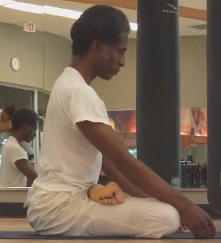

Videos - John Henry Thompson - Invent Your Future 

[John Henry Thompson - Invent Your Future](../index.html)
---------------------------------------------------------

    

[Yoga](../yoga.html)‎ > ‎

### Videos

[**Guru To Go. A portrait of R. Sharath Jois.**](http://www.youtube.com/watch?v=6dSAyFmmARI)  
  
[**A tribute to Hanuman**](http://www.youtube.com/watch?v=lQmVIRiHUho&feature=related) - and [video response](http://kpjdvd.wordpress.com/2011/07/05/flow-of-grace/).  

  

### [Ashtanga Yoga with Sri K. Pattabhi Jois](http://www.kpjashtanga.com/)

**  
My Practice of the The Ashtanga Primary Series**:  
  

[3 Months](http://www.youtube.com/watch?v=bIoiPerB8_Y&cc_load_policy=1)  

  
[6 Months](http://www.youtube.com/watch?v=L6M3EDv51Tk)  
  
[Practice #99](http://www.youtube.com/watch?v=upCetKXWseE)  
  
[9 Months, Practice #100, First Camera](http://www.youtube.com/watch?v=lVgjK5uJNPA)  
[Practice #100, Second Camera](http://www.youtube.com/watch?v=plPbLxta760)  
  
[1 Year, Practice #130](http://www.youtube.com/watch?v=1JmGc0qyk78)  

  

[2 Year, 5 months: Practice #231](http://www.youtube.com/watch?v=zjJI_3KuGR0)  

  

[3 Year: Practice #301](http://www.youtube.com/watch?v=4SZ3CslIb-s&feature=youtu.be)  

  

**\[10x10\]•Strong Present•Strong Future**

[2016-07-18 \[10x10\] Outside the Barnes Foundation, Philadelphia.](https://youtu.be/GyTlLZ-Xkmk)  
2 min 33 secs. 

  
  

  

  

  

Comments

[Sign in](https://accounts.google.com/ServiceLogin?continue=http://sites.google.com/a/johnhenrythompson.com/jht/yoga/videos&service=jotspot)|[Recent Site Activity](../system/app/pages/recentChanges.html)|[Report Abuse](http://sites.google.com/a/johnhenrythompson.com/jht/system/app/pages/reportAbuse)|[Print Page](javascript:;)|Powered By **[Google Sites](http://sites.google.com/site)**

window.jstiming.load.tick('sjl'); window.jstiming.load.tick('jl'); sites.Searchbox.initialize( 'sites-searchbox-search-button', {"object":\[\]}\['object'\], 'search-site', {"label":"Configure search options...","url":"/system/app/pages/admin/settings"}); gsites.HoverPopupMenu.createSiteDropdownMenus('sites-header-nav-dropdown', false); JOT\_setupNav("2bd", "Navigation", true); JOT\_addListener('titleChange', 'JOT\_NAVIGATION\_titleChange', 'COMP\_2bd'); new sites.CommentPane('//docs.google.com/comments/d/AAHRpnXtRMj1XgBLQa4Y22KDIypZzMBseQwT3ox3jtLpaJLSiQKBl\_0RpsjKf2EtiGawF2eHvvJQdreox5QaVC1nLdJKlIoJFQ6MZwnuDfNxbGJXFLeteeIUxpi\_IbMHgvg8X2osGdnn2/api/js?anon=true', false, false); setTimeout(function() { var fingerprint = gsites.date.TimeZone.getFingerprint(\[1109635200000, 1128902400000, 1130657000000, 1143333000000, 1143806400000, 1145000000000, 1146380000000, 1152489600000, 1159800000000, 1159500000000, 1162095000000, 1162075000000, 1162105500000\]); gsites.Xhr.send('http://www.johnhenrythompson.com/\_/tz', null, null, 'GET', null, null, { afjstz: fingerprint }); }, 500); window.onload = function() { if (false) { JOT\_setMobilePreview(); } var loadTimer = window.jstiming.load; loadTimer.tick("ol"); loadTimer\["name"\] = "load," + webspace.page.type + ",user\_page"; window.jstiming.report(loadTimer, {}, 'http://csi.gstatic.com/csi'); } JOT\_insertAnalyticsCode(false, false); var maestroRunner = new gsites.pages.view.SitesMaestroRunner( webspace, "en"); maestroRunner.initListeners(); maestroRunner.installEditRender(); //<!\[CDATA\[ // Decorate any fastUI buttons on the page with a class of 'goog-button'. if (webspace.user.hasWriteAccess) { JOT\_decorateButtons(); } // Fires delayed events. (function() { JOT\_fullyLoaded = true; var delayedEvents = JOT\_delayedEvents; for (var x = 0; x < delayedEvents.length; x++) { var event = delayedEvents\[x\]; JOT\_postEvent(event.eventName, event.eventSrc, event.payload); } JOT\_delayedEvents = null; JOT\_postEvent('pageLoaded'); })(); //\]\]> JOT\_postEvent('decorateGvizCharts'); JOT\_setupPostRenderingManager(); JOT\_postEvent('renderPlus', null, 'sites-chrome-main'); sites.codeembed.init();

window.jstiming.load.tick('render'); JOT\_postEvent('usercontentrendered', this);