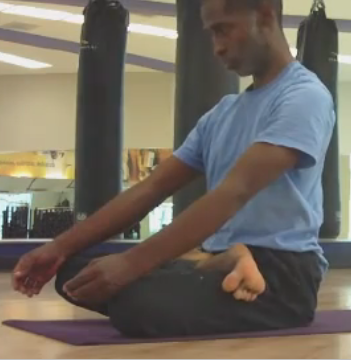

My Yoga Journey (2004 - 2013) 

[John Henry Thompson - Invent Your Future](../index.html)
---------------------------------------------------------

    

[Yoga](../yoga.html)‎ > ‎

### My Yoga Journey (2004 - 2013)

My personal journey to yoga began when I experienced pain and numbness in my right arm. I spend the most of my workday seated, but I try to keep active by going to the gym regularly. I suspect the physically problem was due to working at a computer most of the day and experimented with different sitting arrangements and increased my gym work out. Unfortunately the condition kept worsening.  I found a doctor that diagnosed the cause of the problem: foraminal stenosis at C6-C7 in my neck, a condition where the nerves in the neck are pinched as they come out of the spinal column. I followed all the doctor recommended treatments (traction, steroid pills, steroid injections), but did not experience any improvement. I then tried chiropractic treatment: decompression therapy and massage. I experienced some improvement, or at least it stopped getting worse. 

  

Finally I switched from mostly gym workout to regular yoga classes. Over the course of a few months I experienced significant improvement. The pain and numbness in my right arm decreased significantly and I was able to continue to work at the computer. Also I have discovered other parts of yoga: I have grown to enjoy the Kirtan (a style Indian devotional music), and I eat more plant-based food.

**  
The Beginning - Capoiera and Power Yoga  
  
**

In 2004 I started attending a "Power Yoga" class at [my local gym](http://www.lafitness.com/Pages/clubClassSchedule.aspx?clubid=243) on Sundays. Unlike my previous expose to yoga, the class moved at fast pace and the workout was very aerobic. After the class I'd usually practiced some [Capoeira](http://www.youtube.com/watch?v=OIX9BcYMy7Y) too. I got my start in Capoeira back in the 1980's, attended classes regularly for a few years and drifted in and out of solo practice over the years. The foraminal stenosis problem in my neck was not yet diagnosed and I was using yoga to supplement my existing Capoeira work out.

  

About September of 2007, seeking to improve the problem in my neck, I purchased a Power Yoga DVD by Rodney Lee and practiced yoga daily for several months. I felt some improvement in the problem in my neck and decided to seek out regular yoga classes.

  
**Fours Years Later - Ashtanga primary begins** (Sep 2010)

  

In April of 2008 I started taking Vinyasa yoga classes at the [Main Line Yoga](http://www.dhyana-yoga.com/mainline.html) studio in Ardmore. The classes where not as fast pace as the Power yoga style, but I was challenged in other ways. In May of 2008 I was introduced to Ashtanga Yoga and I like the fact that it was set sequence that you were encourage to practice on your own. I purchased the recommended book: ["Ashtanga Yoga: Practice Manual" by David Swenson](http://www.amazon.com/Ashtanga-Yoga-Practice-Illustrated-Personal/dp/1891252089). I also purchased the [Richard Freeman DVD "Ashtanga Yoga The Primary Series."](http://www.amazon.com/Ashtanga-Yoga-Primary-Richard-Freeman/dp/B000NIVNKK) I was impressed by what I saw as physically possible with a consistent yoga practice. The internal meditation and breathing process describe in the book and DVD intrigued me too. Although I read the Ashtanga book and watched the DVD, from 2008 to 2010 I mostly attended the morning Vinyasa  classes at Main Line Yoga. On my own I occasionally practiced the first movements of Ashtanga primary series (the sun salutation and the standing postures). 

  

In September of 2010 my work schedule changed and I could no longer take regular classes at Main Line Yoga. Fortunately, I was re-introduced to Ashtanga Yoga at the [Yoga Garden in Narbeth](http://www.yogagardennarberth.com/). Coincidently the class was taught by a person that attended the one and only formal Ashtanga Yoga class I attended back in 2008. I took to regular Sunday morning Ashtanga classes at the Yoga Garden and solo Ashtanga practice at my gym. 

  

**Three Months of Ashtanga Primary Study  
**

  

Here's a video of my Ashtanga practice after about 14 weeks of regular practice: [John Henry Thompson Ashtanga primary series practice on Youtube (60 mintutes) ](http://www.youtube.com/watch?v=bIoiPerB8_Y&cc_load_policy=1) In class the full sequence usually takes 90 minutes. [Krishna Das Kirtan music](http://www.krishnadas.com/) is playing in the background. The captions on the video are the name of the asanas (postures) from the David Swenson book.  
  

**Six Months** **of Ashtanga Primary Study**

  

Recording of my Ashtanga primary series practice after 3 months since last recording, approximately 90 days, about 29 sessions.

[John Henry Thompson Ashtanga 2011-03](http://www.youtube.com/watch?v=L6M3EDv51Tk)

  

**Nine Months** **of Ashtanga Primary Study**

My third recording after 3 months since last recording.  

[John Henry Thompson Ashtanga Primary #99](http://www.youtube.com/watch?v=upCetKXWseE) After only 8 minutes my iPhone shut down due to the heat. I, however, enjoyed the extra sweat.  
  
[Here's my 100th practice of Ashtanga Primary.](http://www.youtube.com/watch?v=lVgjK5uJNPA)  
[View from second camera.](http://www.youtube.com/watch?v=plPbLxta760)  
  
**Twelve Months** **of Ashtanga Primary Study** (Oct 2011)  
  
[My fourth recording, 3 months since last recording.](http://www.youtube.com/watch?v=1JmGc0qyk78) Practice #130.  
  
I was fortunate in my twelfth month to take a 5-day Mysore style workshop with [Jill Manning](http://www.jillmanning.com/). Up at 6:30am and practice the sequence at my own pace with guidance from Jill. There were 9 others in the workshop, including the director of Yoga Garden, Mark Nelson. The workshop opened me up to the possibility of an early morning practice. Jill said it was the one "obstacle" to regular practice that removed all the other obstacles. I'm beginning to see what she means. By getting the practice out of the way I don't have to struggle to fit into or around my work schedule or my eating schedule. I have a solid block of time everyday that I can devote to the practice. The key for me was to go to bed time two hours earlier.  Subtract two hours at night, but gain two hours the next day.  
  
In the workshop Jill helped me with a couple of things. She corrected my dristi during Sirsasana. I was looking the at edge of my mat, she correct me to look at my nose. The first time I tried I almost fell down, but now I think my head stand it more vertical - it was at an angle. She help me get achieve a full bind in Marichyasana D, which I haven't been able to fully repeat yet, but my entrance into Marichyasana D has improved. She also corrected my Parivitta Parsvakonasana, Ardha Baddha Padmottanasana, Supta Kurmasana, and Supta Padangusthasana. Thank you Jill.  
  
**Year** **Two** (Nov 2012)  
  
It has been a bumpy ride on the yoga road since a year ago. In early November 2011 (Practice #143) [my lower back issue flared up and kept me out of practice for about 2 months](../z-blog-1/goodbyeandgivingthanks.html). Slowly I built my practice back up and was able to take another Mysore workshop with Jill Manning on March 20, 2012 (Practice #155,#156,#157). My practice slowed down a little after that.  
  
After Practice #160, April 19, 2012, I went to give a mobile app development workshop in Jamaica. Second day into the workshop my lower back flared up again. I haven't had a full practice since then and only in the last week, after over 7 months, have I been able to do an abbreviated practice. I do about 30 minutes on elliptical cycle, then sun salutation A (5 times), B (3-5 times), standing sequence and then closing sequence, with a few additional asanas thrown in. While on the elliptical I listen to [audio books on astrophysics](../z-blog-1/deathbyblackholeandothercosmicquandaries.html) and study my Ashtanga charts.  
  
Let's see if I can continue to re-build to a full practice.  
  
****Year** **Two** \+ 3 Months** (Jan 2013)  
  
Back in the groove. Attending Sunday morning classes at [Yoga Garden](http://yogagardennarberth.com) with Mark. Getting up early to do solo practice at gym 3-4 times per week. Improving but not yet at prior level. January ended with practice #201.  
  
**Year Two + 5 Months** (Mar 2013)  
  
Completed my Ashtanga practice #231 on Sunday March 31, 2013. [Video here](http://www.youtube.com/watch?v=zjJI_3KuGR0).  
  
**Year Two + 10 Months** (Aug 2013)  
  

Had my first private class in Kingston Jamaica with [Shakira Williams](http://about.me/ashtangajamaica), practice #267 on Saturday August 31, 2013. She gave suggestions on entering up dog and lots of cool adjustments.  
  
Back in USA, the [Yoga Garden](http://yogagardennarberth.com) has started offering Tuesday and Thursday 11am - 12:30pm classes with Elizabeth Sitzler in addition to the 8:30 am Sunday classes. Plan on attending all of them.  
  

**Year Three** (Nov 2013)  
  

Capture video of my [practice #301](http://www.youtube.com/watch?v=4SZ3CslIb-s&feature=youtu.behttp://www.youtube.com/watch?v=4SZ3CslIb-s&feature=youtu.be) at Yoga Gargen with Elizabeth Sitzler. Her Tuesday and Thursday classes will end Nov 26. We had a good run. I plan to continue taking Wednesday morning classes at [Ashtanga Yoga School of Philadelphia](http://aysphiladelphia.com) and Sunday classes at Yoga Garden. Will probable start hitting the gym more during the week.  
  

* * *

Copyright © 2011-2013 John Henry Thompson. All rights reserved.

  

  

  

  

  
  

  

  

  

