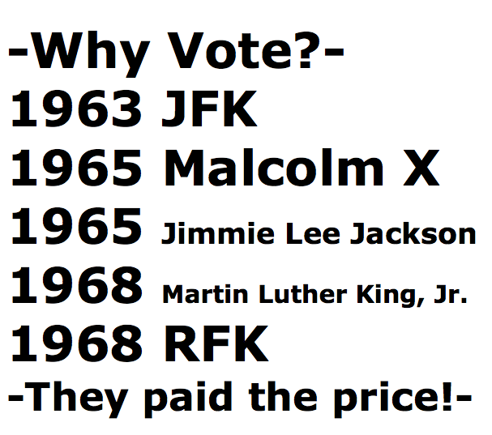

Tr\*mp: Bullsh\*t artist, presidential candidate! - John Henry Thompson - Invent Your Future   
    

[Blog](../z-blog-1.md)‎ > ‎

### Tr\*mp: Bullsh\*t artist, presidential candidate!

posted Oct 19, 2016, 9:18 PM by John Henry Thompson   \[ updated Oct 20, 2016, 2:54 AM \]

...fact checkers rate Trump's statements as entirely false 52% of the time compared to Clinton's 12%... Why do people trust him? Read on...

  

Trump's bullsh\*t: Why his supporters don't care that he's lying by Jeff Hancock

  

[money.cnn.com article 2016/10/17/technology/donald-trump-deception](http://money.cnn.com/2016/10/17/technology/donald-trump-deception/index.html)

  

[amazon.com Bullshit-Lexicon-Mark-Peters](https://www.amazon.com/Bullshit-Lexicon-Mark-Peters/dp/1101904534/ref=sr_1_1?s=books&ie=UTF8&qid=1475877943&sr=1-1&keywords=lexicon+bullshit)

  

[http://www.politifact.com/personalities/donald-trump/](http://www.politifact.com/personalities/donald-trump/)

  

[factcheck.org 2016/10 factchecking-the-final-presidential-debate](http://www.factcheck.org/2016/10/factchecking-the-final-presidential-debate-2/)

  

  

