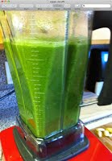

revitalizing 

[Blog](../z-blog-1.md)‎ > ‎

### revitalizing

posted Feb 15, 2012, 8:45 AM by John Henry Thompson   \[ updated Feb 24, 2012, 6:58 PM \]

For a while I have been struggling to find a way to eat more veggies. On January 23 I purchased a blender and started making veggies juices. 2 - 4 cups of veggies a day since then. Problem solved.  
  

  
Start with some fruit and greens.  

  
Veggies get a nice mild soap bath and rinse.  

  
Mix vigorously in 2hp blender .  

  

  

  

  

