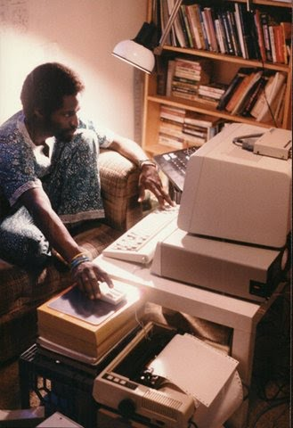

/\* Copyright 2008 Google. \*/ (function() { (function(){function e(g){this.t={};this.tick=function(h,k,f){this.t\[h\]=\[void 0!=f?f:(new Date).getTime(),k\];if(void 0==f)try{window.console.timeStamp("CSI/"+h)}catch(m){}};this.tick("start",null,g)}var a;if(window.performance)var d=(a=window.performance.timing)&&a.responseStart;var l=0<d?new e(d):new e;window.jstiming={Timer:e,load:l};if(a){var b=a.navigationStart;0<b&&d>=b&&(window.jstiming.srt=d-b)}if(a){var c=window.jstiming.load;0<b&&d>=b&&(c.tick("\_wtsrt",void 0,b),c.tick("wtsrt\_","\_wtsrt", d),c.tick("tbsd\_","wtsrt\_"))}try{a=null,window.chrome&&window.chrome.csi&&(a=Math.floor(window.chrome.csi().pageT),c&&0<b&&(c.tick("\_tbnd",void 0,window.chrome.csi().startE),c.tick("tbnd\_","\_tbnd",b))),null==a&&window.gtbExternal&&(a=window.gtbExternal.pageT()),null==a&&window.external&&(a=window.external.pageT,c&&0<b&&(c.tick("\_tbnd",void 0,window.external.startE),c.tick("tbnd\_","\_tbnd",b))),a&&(window.jstiming.pt=a)}catch(g){}})(); })() /\* Copyright 2008 Google. \*/ (function() { function d(a){return document.getElementById(a)}window.byId=d;function g(a){return a.replace(/^\\s+|\\s+\$/g,"")}window.trim=g;var h=\[\],k=0;window.JOT_addListener=function(a,b,c){var f=new String(k++);a={eventName:a,handler:b,compId:c,key:f};h.push(a);return f};window.JOT_removeListenerByKey=function(a){for(var b=0;b<h.length;b++)if(h\[b\].key==a){h.splice(b,1);break}};window.JOT_removeAllListenersForName=function(a){for(var b=0;b<h.length;b++)h\[b\].eventName==a&&h.splice(b,1)}; window.JOT_postEvent=function(a,b,c){var f={eventName:a,eventSrc:b||{},payload:c||{}};if(window.JOT_fullyLoaded)for(b=h.length,c=0;c<b&&c<h.length;c++){var e=h\[c\];e&&e.eventName==a&&(f.listenerCompId=e.compId||"",(e="function"==typeof e.handler?e.handler:window\[e.handler\])&&e(f))}else window.JOT_delayedEvents.push({eventName:a,eventSrc:b,payload:c})};window.JOT_delayedEvents=\[\];window.JOT_fullyLoaded=!1; window.JOT_formatRelativeToNow=function(a,b){a=((new Date).getTime()-a)/6E4;if(1440<=a||0>a)return null;var c=0;60<=a&&(a/=60,c=2);2<=a&&c++;return b?window.JOT_siteRelTimeStrs\[c\].replace("\_\_duration\_\_",Math.floor(a)):window.JOT_userRelTimeStrs\[c\].replace("\_\_duration\_\_",Math.floor(a))}; })() var breadcrumbs = \[{"path":"/home","deleted":false,"title":"About me","dir":"ltr"}\]; var JOT_clearDotPath = 'http://www.gstatic.com/sites/p/fb83f7/system/app/images/cleardot.gif'; var JOT_userRelTimeStrs = \["a minute ago","\_\_duration\_\_ minutes ago","an hour ago","\_\_duration\_\_ hours ago"\]; var webspace = {"gvizGstaticVersion":"current","enableAnalytics":false,"pageSharingId":"jotspot_page","codeembeds":{"outerIframeSrc":"https://www.gstatic.com/jotspot/embeds/code/0f08d42392f2000e7e3f3daf5b427a43/outer\_iframe.html","innerIframeSrc":"https://202117001-jotspot-embeds.googleusercontent.com/code/8d87fa64604b2a11fae2ed06104c58d3/inner\_iframe.html"},"enableUniversalAnalytics":false,"sharingPolicy":"OPENED\_WITH\_INDICATOR","siteTitle":"John Henry Thompson - Invent Your Future","jot2atari":{"eligibility":"ineligible"},"onepickUrl":"https://docs.google.com/picker","adsensePublisherId":null,"features":{"moreMobileStyleImprovements":null,"subscriptionDataMigrationInProgress":false,"plusBadge":false},"isPublic":true,"newSitesBaseUrl":"https://sites.google.com","isConsumer":false,"serverFlags":{"jot2AtariLearnMoreUrl":"https://support.google.com/sites/answer/7035197"},"domainAnalyticsAccountId":"","plusPageId":"","signInUrl":"https://accounts.google.com/AccountChooser?continue\\u003dhttp://sites.google.com/a/johnhenrythompson.com/jht/home\\u0026service\\u003djotspot","analyticsAccountId":"","scottyUrl":"/\_/upload","homePath":"/","siteNoticeUrlEnabled":null,"plusPageUrl":"","adsensePromoClickedOrSiteIneligible":true,"csiReportUri":"http://csi.gstatic.com/csi","sharingId":"jotspot","termsUrl":"//www.google.com/intl/en/policies/terms/","gvizVersion":1,"editorResources":{"sitelayout":\["http://www.gstatic.com/sites/p/fb83f7/system/app/css/sitelayouteditor.css"\],"text":\["http://www.gstatic.com/sites/p/fb83f7/system/js/codemirror.js","http://www.gstatic.com/sites/p/fb83f7/system/app/css/codemirror\_css.css","http://www.gstatic.com/sites/p/fb83f7/system/js/trog\_edit\_\_en.js","http://www.gstatic.com/sites/p/fb83f7/system/app/css/trogedit.css","/\_/rsrc/1570087315000/system/app/css/editor.css","http://www.gstatic.com/sites/p/fb83f7/system/app/css/codeeditor.css","/\_/rsrc/1570087315000/system/app/css/camelot/editor-jfk.css"\]},"sharingUrlPrefix":"/\_/sharing","isAdsenseEnabled":true,"domain":"johnhenrythompson.com","baseUri":"","name":"jht","siteTemplateId":false,"siteNoticeRevision":null,"siteNoticeUrlAddress":null,"siteNoticeMessage":null,"page":{"isRtlLocale":false,"canDeleteWebspace":null,"isPageDraft":null,"parentPath":null,"parentWuid":null,"siteLocale":"en","timeZone":"America/Los\_Angeles","type":"text","title":"About me","locale":"en","wuid":"wuid:gx:7d1cf15857900a2e","revision":61,"path":"/home","isSiteRtlLocale":false,"pageInheritsPermissions":null,"name":"home","canChangePath":false,"state":"","properties":{},"bidiEnabled":false,"currentTemplate":{"path":"/system/app/pagetemplates/text","title":"Web Page"}},"canPublishScriptToAnyone":true,"user":{"keyboardShortcuts":true,"sessionIndex":"","onePickToken":"","guest\_":true,"displayNameOrEmail":"guest","userName":"guest","uid":"","renderMobile":false,"domain":"","namespace":"","hasWriteAccess":false,"namespaceUser":false,"primaryEmail":"guest","hasAdminAccess":false},"gadgets":{"baseUri":"/system/app/pages/gadgets"}}; webspace.page.breadcrumbs = breadcrumbs; var JOT_siteRelTimeStrs = \["a minute ago","\_\_duration\_\_ minutes ago","an hour ago","\_\_duration\_\_ hours ago"\]; window.jstiming.load.tick('scl'); John Henry Thompson - Invent Your Future

## [John Henry Thompson - Invent Your Future](index.html)

Search this site

- About me

- [0\. Reflections](0-refections-on-learning.html)

- [1\. Learn to Code](learning-to-program.html)

- [2\. The Art of Learning](the-art-of-learning.html)

- [3\. DICE](3-dice.html)

- [4\. History](4-history.html)

- [5\. Respect](heros.html)

- [Artifacts](artifacts.html)

- [Blog](z-blog-1.html)

- [Garden](4-garden.html)

- [iPhone Apps](iphone-apps.html)

- [Notes](notes.html)

- [Photos](family.html)

- [Yoga](yoga.html)

- [Sitemap](system/app/pages/sitemap/hierarchy.html)

### About me

This is the personal web site of John Henry Thompson.

#### Subpage Listing

- [Ancestors](home/who-am-i.html)

- [Brief Bio](home/bio.html)

- [interview 2010](home/interview-2010.html)

- [Interviews 1994 - 2012](home/interviews.html)

I like to see how the pixels work, that's why this image looks so fuzzy...

I want to make it easy for people to use the computer as an expressive instrument, and to inspire people to learn about themselves and the world.

> [Current project: DICE](3-dice.html)

>

> [Where I work.](iphone-apps.html)

> [Photohacker workshop](https://github.com/jht1900/photohacker).

> [online javascript class at codehs.com](http://codehs.com/go/7444)

[My videos on youtube.com/user/jht1900](http://www.youtube.com/user/jht1900)

[My other website www.j4u2.com](http://www.j4u2.com/)

>

What  the web says about me:

> [Connecting the past to the present with Laura Powers](https://www.youtube.com/watch?v=46rz6-uD_E4&list=PL_nujIbA6R4sYW-PQ0QNAu8vqJgPhUFeC) 2015

[John Henry Thompson - www.black-inventor.com](http://www.black-inventor.com/John-Thompson.asp)

[John Thompson - www.ieeeghn.org](http://www.ieeeghn.org/wiki/index.php/John_Thompson)

Other links

[Jervis Thompson - my little bro](http://www.jervo.com/blog/da-lingo-kid/)

[“NYU/ITP Black Genius Award 1997” video](http://www.youtube.com/watch?v=9OesTbXh5us)

Recent experiments:

#### DICE 2018 Demo

[Patanjali 4.17 "An object is known or unknown depending on whether or not the mind gets colored by it."](yoga/patanjani/book-4/417.html)

2018 DICE: Iron Pixel

  
2012 iPhone app to colorize video.

  
Back in the 1980's - 3D animation and video still.

Color Dance - colorized music video.

  
That's an IBM PC second edition, 1984.

Subpages (4): [Ancestors](home/who-am-i.html) [Brief Bio](home/bio.html) [interview 2010](home/interview-2010.html) [Interviews 1994 - 2012](home/interviews.html)

[Sign in](https://accounts.google.com/ServiceLogin?continue=http://sites.google.com/a/johnhenrythompson.com/jht/home&service=jotspot)|[Recent Site Activity](system/app/pages/recentChanges.html)|[Report Abuse](http://sites.google.com/a/johnhenrythompson.com/jht/system/app/pages/reportAbuse)|[Print Page](javascript:;)|Powered By **[Google Sites](http://sites.google.com/site)**
